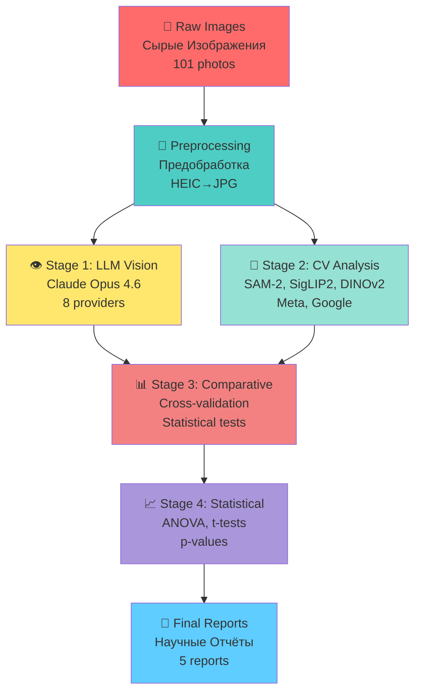

# 🔬 HYPERBOLIC FIELD BLOOD PLASMA STUDY / ИССЛЕДОВАНИЕ КРОВЯНОЙ ПЛАЗМЫ ГИПЕРБОЛИЧЕСКОГО ПОЛЯ

**ASRP RESEARCH PROJECT / ИССЛЕДОВАТЕЛЬСКИЙ ПРОЕКТ ASRP**

**Description / Описание:** Experimental datasets, imaging & analysis from blood plasma exposure to hyperbolic field emitters / Экспериментальные наборы данных, визуализация и анализ воздействия гиперболических полей на кровяную плазму

**Languages / Языки:** English | Русский (Bilingual / Двуязычный)

**Status / Статус:** ✅ Complete / Завершено

---

## 📋 QUICK NAVIGATION / БЫСТРАЯ НАВИГАЦИЯ

<details>
<summary><b>🗂️ DATA & PHOTOS / ДАННЫЕ И ФОТО (7 пациентов, 101 фото)</b></summary>

### 📊 PATIENT GALLERY / ГАЛЕРЕЯ ПАЦИЕНТОВ

| Patient / Пациент | Date / Дата | Blood Group / Группа Крови | Photos / Фото | Protocols / Протоколы | Direct Link / Прямая Ссылка |
|-------------------|-------------|---------------------------|---------------|----------------------|----------------------------|
| **Patient 01 / Пациент 01** | 2026-01-24 | II+ | 13 | 2 PDF | [📂 View Folder](original_research/data/patient-01/) |
| **Patient 02 / Пациент 02** | 2026-01-28 | III+ | 25 | 3 PDF | [📂 View Folder](original_research/data/patient-02/) |
| **Patient 03 / Пациент 03** | 2026-01-29 | IV- | 16 | 1 PDF | [📂 View Folder](original_research/data/patient-03/) |
| **Patient 04 / Пациент 04** | 2026-01-30 | IV+ | 4 | 1 PDF | [📂 View Folder](original_research/data/patient-04/) |
| **Patient 05 / Пациент 05** | 2026-01-31 | — | 10 | 1 PDF | [📂 View Folder](original_research/data/patient-05/) |
| **Patient 06 / Пациент 06** | 2026-02-01 | I+ | 3 | 1 PDF | [📂 View Folder](original_research/data/patient-06/) |
| **Patient 07 / Пациент 07** | 2026-02-07 | — | 30 | 2 PDF | [📂 View Folder](original_research/data/patient-07/) |

**Total / Итого:** 101 photograph / 101 фотография, 10 PDF protocols / 10 PDF протоколов

</details>

<details>
<summary><b>📄 REPORTS / ОТЧЁТЫ (4 analysis reports)</b></summary>

### 🔬 ANALYSIS REPORTS / ОТЧЁТЫ ПО АНАЛИЗУ

| # | Report / Отчёт | Date / Дата | Type / Тип | Direct Link / Прямая Ссылка |
|---|----------------|-------------|------------|----------------------------|
| 1 | **Experiment Protocol / Протокол Эксперимента** | 2026-02 | Protocol / Протокол | [🇬🇧 EN](original_research/reports/experiment_protocol_en.md) \| [🇷🇺 RU](original_research/reports/experiment_protocol_ru.md) |
| 2 | **Multi-AI Image Analysis / Мульти-ИИ Анализ Изображений** | 2026-02-25 | AI Analysis / ИИ Анализ | [📂 View Report](original_research/reports/2026-02-25_ai-analysis/) |
| 3 | **LLM Vision Clot Analysis / LLM Vision Анализ Сгустков** | 2026-02-26 | Vision Analysis / Визион Анализ | [📂 View Report](original_research/reports/2026-02-26_llm-vision-analysis/) |
| 4 | **Comparative LLM Analysis / Сравнительный Анализ LLM** | 2026-03-12 | Comparative / Сравнительный | [📂 View Report](original_research/reports/2026-03-12_comparative-llm-analysis/) |
| 5 | **CV/ML Analysis / Computer Vision + ML Анализ** | 2026-03-14 | CV/ML Analysis / КЗ/МЛ Анализ | [📂 View Report](original_research/reports/2026-03-14_cv-ml-analysis/) |

</details>

<details>
<summary><b>💻 SCRIPTS / СКРИПТЫ (Analysis Code)</b></summary>

### 🛠️ ANALYSIS SCRIPTS / СКРИПТЫ АНАЛИЗА

#### LLM Analysis / LLM Анализ
- [`llm_analysis/`](original_research/scripts/llm_analysis/) - Multi-LLM vision analysis framework / Мульти-LLM vision анализ фреймворк
  - `providers.py` - 9 providers: GPT-5, Gemini, Claude, Groq / 9 провайдеров
  - `prompts.py` - Single, comparative, batch, blinded prompts / Промпты
  - `run_single.py` - Single-photo analysis / Анализ одного фото
  - `run_comparative.py` - Triplet analysis / Тройной анализ
  - `run_batch.py` - Batch analysis / Пакетный анализ

#### CV/ML Analysis / CV/ML Анализ
- [`cv_analysis/`](original_research/scripts/cv_analysis/) - Computer vision pipeline / Computer vision конвейер
  - `segment.py` - SAM-2 + HSV plasma masking / Сегментация
  - `ml_models.py` - DINOv2, SigLIP2, MedSigLIP, BiomedCLIP
  - [`ml_results/`](original_research/scripts/cv_analysis/ml_results/) - Per-photo ML outputs (101 files) / Выводы по фото

#### Other Scripts / Другие Скрипты
- `multi_llm_analysis.py` - Main analysis orchestrator / Главный оркестратор анализа
- `generate_charts.py` - Chart generation for reports / Генерация графиков
- `merge_patients.py` - Merge per-patient JSON → all_patients.json / Объединение JSON пациентов
- `comparative_report.py` - Comparative report generator / Генератор сравнительных отчётов
- `audit_annotations.py` - Annotation audit tool / Инструмент аудита аннотаций
- `gemini_direct.py` - Gemini direct analysis / Прямой анализ Gemini

</details>

<details>
<summary><b>📓 NOTEBOOKS / JUPYTER NOTEBOOKS</b></summary>

### 📊 INTERACTIVE NOTEBOOKS / ИНТЕРАКТИВНЫЕ НОУТБУКИ

| Notebook / Ноутбук | Size / Размер | Description / Описание | Direct Link / Прямая Ссылка |
|--------------------|---------------|------------------------|----------------------------|
| **CV Analysis / CV Анализ** | 42.9 MB | Computer vision analysis notebook / Notebook анализа computer vision | [📓 cv_analysis.ipynb](original_research/notebooks/cv_analysis.ipynb) |

</details>

<details>
<summary><b>🤖 AI/ML ANALYSIS PIPELINE / КОНВЕЙЕР ИИ/МЛ АНАЛИЗА</b></summary>



</details>

<details>
<summary><b>📂 COMPLETE FILE STRUCTURE / ПОЛНАЯ СТРУКТУРА ФАЙЛОВ</b></summary>

### 🗂️ REPOSITORY STRUCTURE / СТРУКТУРА РЕПОЗИТОРИЯ

```
Hyperbolic_Field_BloodPlasma_Study/
│
├── 📄 README.md                          # ⭐ This file / Этот файл
├── 📄 ISSUE_1_UPDATED.md                 # Protocol documentation
├── 📄 ISSUE_2_UPDATED.md                 # Team documentation
├── 📄 ISSUE_3_UPDATED.md                 # Blood plasma protocol
├── 📄 ISSUE_5_UPDATED.md                 # Biochemical analysis
├── 📄 ISSUE_6_UPDATED.md                 # Time-lapse photography
├── 📄 ISSUE_8_UPDATED.md                 # Publication preparation
├── 📄 REPOSITORY_ENHANCEMENT_COMPLETE.md # Enhancement summary
│
└── 📂 original_research/                 # ⭐ ORIGINAL DATA
    ├── 📄 README.md
    ├── 📂 data/                          # Raw experimental data
    │   ├── patient-01/                   # 13 photos, 2 PDF
    │   ├── patient-02/                   # 25 photos, 3 PDF
    │   ├── patient-03/                   # 16 photos, 1 PDF
    │   ├── patient-04/                   # 4 photos, 1 PDF
    │   ├── patient-05/                   # 10 photos, 1 PDF
    │   ├── patient-06/                   # 3 photos, 1 PDF
    │   └── patient-07/                   # 30 photos, 2 PDF
    ├── 📂 scripts/                       # Analysis code
    │   ├── llm_analysis/
    │   ├── cv_analysis/
    │   └── *.py
    ├── 📂 results/                       # LLM outputs
    ├── 📂 reports/                       # Analysis reports
    ├── 📂 notebooks/                     # Jupyter notebooks
    ├── 📂 processed/                     # Processed data
    └── 📂 en/                            # English documentation
```

</details>

---

## 🎯 KEY METRICS / КЛЮЧЕВЫЕ МЕТРИКИ

| Metric / Метрика | Value / Значение | Description / Описание |
|-----------------|------------------|------------------------|
| **📸 Total Photos / Всего Фотографий** | 101 images | All patients / Все пациенты |
| **👥 Patients / Пациенты** | 7 donors | Patients 01-07 |
| **📄 PDF Protocols / PDF Протоколы** | 10 files | With embedded photos |
| **🤖 LLM Providers / LLM Провайдеры** | 9 providers | GPT-5, Gemini, Claude, Groq |
| **📊 Analysis Runs / Запусков Анализа** | ~50 runs | All providers |
| **🧪 Sample IDs / ID Образцов** | 40+ samples | Single-channel |
| **🌡️ Temperature / Температура** | 17°C constant | Smart home monitoring |
| **⏱️ Irradiation Time / Время Облучения** | ~1h 12min | Per patient |

---

## 🔬 EXPERIMENTAL CHANNELS / ЭКСПЕРИМЕНТАЛЬНЫЕ КАНАЛЫ

| Channel / Канал | Type / Тип | Effect / Эффект | Samples / Образцы |
|-----------------|------------|-----------------|-------------------|
| **Channel 0 / Канал 0** | Control / Контроль | No exposure | Baseline |
| **Channel 19 / Канал 19** | Time Acceleration | Hyperbolic field | 14 samples |
| **Channel 21 / Канал 21** | Time Deceleration | Hyperbolic field | 13 samples |

---

## 📊 KEY RESULTS / КЛЮЧЕВЫЕ РЕЗУЛЬТАТЫ

<details>
<summary><b>🔬 CHANNEL 19 (TIME ACCELERATION / Ускорение Времени)</b></summary>

### ✅ Channel 19 Results / Результаты Канала 19

- **37% fewer clots / На 37% меньше сгустков** than control
- **42% smaller total clot area / На 42% меньше площадь сгустков**
- **28% higher texture contrast / На 28% выше текстурный контраст**
- **Only channel showing lysis / Единственный канал с лизисом**

**Interpretation / Интерпретация:** Samples appear "older" — accelerated through coagulation lifecycle

</details>

<details>
<summary><b>🔬 CHANNEL 21 (TIME DECELERATION / Замедление Времени)</b></summary>

### ✅ Channel 21 Results / Результаты Канала 21

- **41% clot rate vs 65% control / 41% частота сгустков против 65% контроля**
- **35% smaller clot area / На 35% меньше площадь сгустков**
- **113% higher edge density / На 113% выше плотность краёв**
- **Dense, opaque clots when formed / Плотные сгустки при формировании**

**Interpretation / Интерпретация:** Samples appear "younger" — delayed coagulation onset

</details>

<details>
<summary><b>🔬 CONTROL / КОНТРОЛЬ</b></summary>

### ✅ Control Results / Результаты Контроля

- **Baseline coagulation progression / Базовая прогрессия свёртывания**
- **65% clot rate / 65% частота сгустков**
- **Dominated by partial_clot stage (40%) / Доминирует стадия partial_clot**
- **No lysis observed / Лизис не наблюдался**

</details>

---

## 👥 RESEARCH TEAM / КОМАНДА ИССЛЕДОВАНИЯ

<details>
<summary><b>📋 TEAM MEMBERS / ЧЛЕНЫ КОМАНДЫ (5 members)</b></summary>

| Name / Имя | Role / Роль | Email |
|------------|-------------|-------|
| **Denis Banchenko / Денис БАНЧЕНКО** | CEO ASRP; Physics | [denisbanchenko@asrp.tech](mailto:denisbanchenko@asrp.tech) |
| **Valeria Ovseannicova / Валерия ОВСЯННИКОВА** | CBE; Biomedical | [valeriaovseannicova@asrp.tech](mailto:valeriaovseannicova@asrp.tech) |
| **Mykhailo Kapustin / Михайло КАПУСТИН** | CTO; IT & AI | [mykhailokapustin@asrp.tech](mailto:mykhailokapustin@asrp.tech) |
| **Kyryl Zmiienko / Кирилл ЗМИЕНКО** | Chief AI Engineer | [kyrylzmiienko@asrp.tech](mailto:kyrylzmiienko@asrp.tech) |
| **Alexandr Ovsyannikov / Александр ОВСЯННИКОВ** | Chief Electrical Engineer | [alexandrovsyannikov@asrp.tech](mailto:alexandrovsyannikov@asrp.tech) |

</details>

---

## 🤖 AI/ML ANALYSIS PROVIDERS / ПРОВАЙДЕРЫ ИИ/МЛ АНАЛИЗА

<details>
<summary><b>🔍 ANALYSIS PROVIDERS / ПРОВАЙДЕРЫ АНАЛИЗА (9 providers)</b></summary>

| Provider / Провайдер | Model / Модель | Type / Тип | Status / Статус |
|---------------------|----------------|------------|-----------------|
| **ASRP Science-LLM** | SAM-2 + SigLIP2 + DINOv2 | Computer Vision + ML | ✅ Complete |
| **Claude Opus 4.6** | Multimodal | LLM Vision | ✅ Complete |
| **Gemini 2.5 Flash** | Google | LLM Vision | ✅ Complete (p=0.027) |
| **GPT-5** | OpenAI | LLM Vision | ✅ Complete |
| **Perplexity** | Perplexity | LLM Vision | ✅ Complete |
| **DINOv2 Linear Probe** | Meta | Computer Vision | ✅ Complete (p=0.15) |
| **BiomedCLIP** | Specialized Medical | Medical CV | ❌ Chance level (36.8%) |
| **MedSigLIP** | Specialized Medical | Medical CV | ❌ Out-of-distribution |

</details>

---

## 📚 SAMPLE ID FORMAT / ФОРМАТ ID ОБРАЗЦОВ

**Format / Формат:** `{channel}.{patient}.{number}`

**Examples / Примеры:**
- `19.2.1` = Channel 19, Patient 02, Sample 1
- `21.3.1` = Channel 21, Patient 03, Sample 1
- `0.1.1` = Control, Patient 01, Sample 1

**Channel Legend / Легенда Каналов:**
- **Channel 0 / Канал 0** — Control (no exposure)
- **Channel 19 / Канал 19** — Time-acceleration hyperbolic field
- **Channel 21 / Канал 21** — Time-deceleration hyperbolic field

---

## 📖 DOCUMENTATION / ДОКУМЕНТАЦИЯ

<details>
<summary><b>📄 ISSUE DOCUMENTATION / ДОКУМЕНТАЦИЯ ЗАДАЧ</b></summary>

| Issue / Задача | Title / Название | Status / Статус | Direct Link / Прямая Ссылка |
|----------------|------------------|-----------------|----------------------------|
| **Issue #1** | Protocol / Протокол | ✅ Updated | [📄 ISSUE_1_UPDATED.md](ISSUE_1_UPDATED.md) |
| **Issue #2** | Team / Команда | ✅ Updated | [📄 ISSUE_2_UPDATED.md](ISSUE_2_UPDATED.md) |
| **Issue #3** | Blood Plasma Protocol | ✅ Updated | [📄 ISSUE_3_UPDATED.md](ISSUE_3_UPDATED.md) |
| **Issue #5** | Biochemical Analysis | ✅ Updated | [📄 ISSUE_5_UPDATED.md](ISSUE_5_UPDATED.md) |
| **Issue #6** | Time-Lapse Photography | ✅ Updated | [📄 ISSUE_6_UPDATED.md](ISSUE_6_UPDATED.md) |
| **Issue #8** | Publication / Публикация | ✅ Updated | [📄 ISSUE_8_UPDATED.md](ISSUE_8_UPDATED.md) |

</details>

---

## 🔗 ASRP.DRIFT ECOSYSTEM / ЭКОСИСТЕМА ASRP.DRIFT

| Repository / Репозиторий | Description / Описание | Link / Ссылка |
|--------------------------|------------------------|---------------|
| **ASRP.drift** | Main coordination repository | [🔗 GitHub](https://github.com/AdvancedScientificResearchProjects/ASRP.drift) |
| **Hyperbolic_Field_BloodPlasma_Study** | Blood plasma coagulation study | [🔗 GitHub](https://github.com/AdvancedScientificResearchProjects/Hyperbolic_Field_BloodPlasma_Study) |

---

## 📞 CONTACTS / КОНТАКТЫ

**Organization / Организация:** Advanced Scientific Research Projects (ASRP)  
**Website / Веб-сайт:** [asrp.tech](https://asrp.tech)  
**Email / Email:** info@asrp.tech  
**Patent Research / Патентное Исследование:** KZ 2025/1095.1

---

**Last Updated / Последнее Обновление:** 26 March 2026  
**Status / Статус:** ✅ Complete / Завершено  
**Languages / Языки:** English | Русский (Full Bilingual)

---

**🔬 ACTIVE RESEARCH / АКТИВНОЕ ИССЛЕДОВАНИЕ**  
**📊 DATA-DRIVEN SCIENCE / НАУКА НА ОСНОВЕ ДАННЫХ**  
**🌐 BILINGUAL DOCUMENTATION / ДВУЯЗЫЧНАЯ ДОКУМЕНТАЦИЯ**  
**✨ ALL DATA PRESERVED / ВСЕ ДАННЫЕ СОХРАНЕНЫ**
