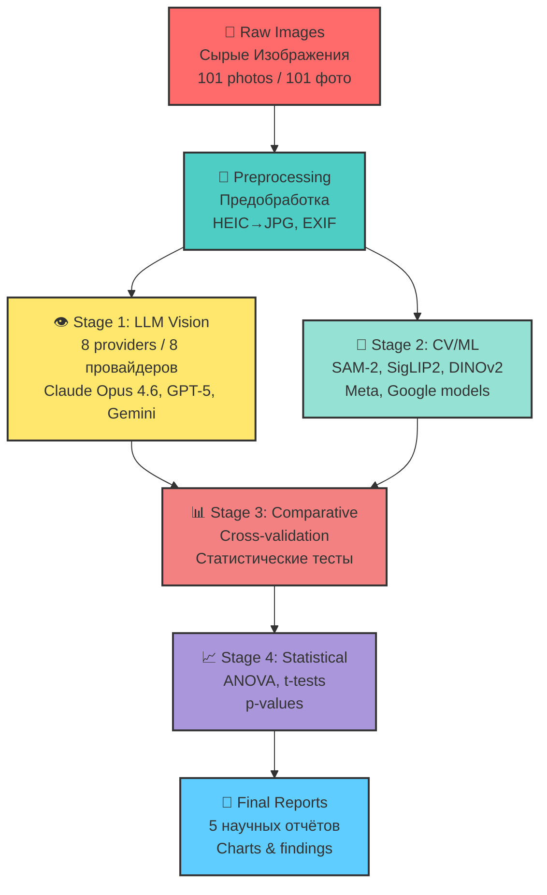

# 🔬 HYPERBOLIC FIELD BLOOD PLASMA STUDY / ИССЛЕДОВАНИЕ КРОВЯНОЙ ПЛАЗМЫ ГИПЕРБОЛИЧЕСКОГО ПОЛЯ

**ASRP RESEARCH PROJECT / ИССЛЕДОВАТЕЛЬСКИЙ ПРОЕКТ ASRP**

**Description / Описание:** Experimental datasets, imaging & analysis from blood plasma exposure to hyperbolic field emitters / Экспериментальные наборы данных, визуализация и анализ воздействия гиперболических полей на кровяную плазму

**Languages / Языки:** English | Русский (Bilingual / Двуязычный)

**Status / Статус:** ✅ Complete / Завершено

**⚠️ BACKUP PROTECTED / ЗАЩИЩЕНО РЕЗЕРВНОЙ КОПИЕЙ:** All data preserved in `/mnt/transcend/ALL_DENIS_BANCHENKO/BUSINESS/ASRP/BACKUPS/Hyperbolic_Field_BloodPlasma_Study/LOCAL_BACKUP/`

---

## 📋 QUICK NAVIGATION / БЫСТРАЯ НАВИГАЦИЯ

| 🗂️ Data & Photos | 📄 Reports | 💻 Scripts | 📊 Results |
|-------------------|------------|------------|------------|
| [Patient Gallery](#-patient-gallery--галерея-пациентов) | [All Reports](#-reports--отчёты) | [Analysis Code](#-scripts--скрипты) | [Key Findings](#-key-results--ключевые-результаты) |
| [101 Photos](#-patient-gallery--галерея-пациентов) | [5 Analysis](#-reports--отчёты) | [LLM + CV/ML](#-scripts--скрипты) | [Channels 0/19/21](#-key-results--ключевые-результаты) |

---

## 🗂️ DATA & PHOTOS / ДАННЫЕ И ФОТО

<details>
<summary><b>📊 PATIENT GALLERY / ГАЛЕРЕЯ ПАЦИЕНТОВ (Click to expand / Нажмите для раскрытия)</b></summary>

### 📊 PATIENT GALLERY / ГАЛЕРЕЯ ПАЦИЕНТОВ

| Patient / Пациент | Date / Дата | Blood Group / Группа Крови | Photos / Фото | Protocols / Протоколы | Direct Link / Прямая Ссылка |
|-------------------|-------------|---------------------------|---------------|----------------------|----------------------------|
| **Patient 01 / Пациент 01** | 2026-01-24 | II+ | 13 | 2 PDF | [📂 View Folder](original_research/data/patient-01/) |
| **Patient 02 / Пациент 02** | 2026-01-28 | III+ | 25 | 3 PDF | [📂 View Folder](original_research/data/patient-02/) |
| **Patient 03 / Пациент 03** | 2026-01-29 | IV- | 16 | 1 PDF | [📂 View Folder](original_research/data/patient-03/) |
| **Patient 04 / Пациент 04** | 2026-01-30 | IV+ | 4 | 1 PDF | [📂 View Folder](original_research/data/patient-04/) |
| **Patient 05 / Пациент 05** | 2026-01-31 | — | 10 | 1 PDF | [📂 View Folder](original_research/data/patient-05/) |
| **Patient 06 / Пациент 06** | 2026-02-01 | I+ | 3 | 1 PDF | [📂 View Folder](original_research/data/patient-06/) |
| **Patient 07 / Пациент 07** | 2026-02-07 | — | 30 | 2 PDF | [📂 View Folder](original_research/data/patient-07/) |

**✅ Total / Итого:** 101 photographs / 101 фотография, 10 PDF protocols / 10 PDF протоколов, 7 patients / 7 пациентов

### 📸 PHOTO STRUCTURE / СТРУКТУРА ФОТО

Each patient folder contains / Каждая папка пациента содержит:
- `photos/original/` - HEIC files (iPhone 16 Pro Max, 4032×3024)
- `photos/jpg/` - Converted JPG for analysis
- `protocol_part-*.pdf` - Physical protocols with embedded photos
- `metadata.json` - EXIF data for all photos
- `en/README.md` - Per-patient protocol description

</details>

<details>
<summary><b>📄 REPORTS / ОТЧЁТЫ (5 analysis reports)</b></summary>

### 🔬 ANALYSIS REPORTS / ОТЧЁТЫ ПО АНАЛИЗУ

| # | Report / Отчёт | Date / Дата | Type / Тип | Direct Link / Прямая Ссылка |
|---|----------------|-------------|------------|----------------------------|
| 1 | **Experiment Protocol / Протокол Эксперимента** | 2026-02 | Protocol / Протокол | [🇬🇧 EN](original_research/reports/experiment_protocol_en.md) \| [🇷🇺 RU](original_research/reports/experiment_protocol_ru.md) |
| 2 | **Multi-AI Image Analysis / Мульти-ИИ Анализ Изображений** | 2026-02-25 | AI Analysis / ИИ Анализ | [📂 View Report](original_research/reports/2026-02-25_ai-analysis/) |
| 3 | **LLM Vision Clot Analysis / LLM Vision Анализ Сгустков** | 2026-02-26 | Vision Analysis / Визион Анализ | [📂 View Report](original_research/reports/2026-02-26_llm-vision-analysis/) |
| 4 | **Comparative LLM Analysis / Сравнительный Анализ LLM** | 2026-03-12 | Comparative / Сравнительный | [📂 View Report](original_research/reports/2026-03-12_comparative-llm-analysis/) |
| 5 | **CV/ML Analysis / Computer Vision + ML Анализ** | 2026-03-14 | CV/ML Analysis / КЗ/МЛ Анализ | [📂 View Report](original_research/reports/2026-03-14_cv-ml-analysis/) |

</details>

<details>
<summary><b>💻 SCRIPTS / СКРИПТЫ (Analysis Code)</b></summary>

### 🛠️ ANALYSIS SCRIPTS / СКРИПТЫ АНАЛИЗА

#### LLM Analysis / LLM Анализ
- [`llm_analysis/`](original_research/scripts/llm_analysis/) - Multi-LLM vision analysis framework
  - `providers.py` - 9 providers: GPT-5, Gemini, Claude, Groq, Perplexity
  - `prompts.py` - Single, comparative, batch, blinded prompts
  - `run_single.py` - Single-photo analysis
  - `run_comparative.py` - Triplet analysis (control + ch19 + ch21)
  - `run_batch.py` - All-patients batch analysis

#### CV/ML Analysis / CV/ML Анализ
- [`cv_analysis/`](original_research/scripts/cv_analysis/) - Computer vision pipeline
  - `segment.py` - SAM-2 + HSV plasma masking, CV clot detection
  - `ml_models.py` - DINOv2, SigLIP2, MedSigLIP, BiomedCLIP
  - [`ml_results/`](original_research/scripts/cv_analysis/ml_results/) - Per-photo ML outputs (101 files)

#### Other Scripts / Другие Скрипты
- `multi_llm_analysis.py` - Main analysis orchestrator
- `generate_charts.py` - Chart generation for reports
- `merge_patients.py` - Merge per-patient JSON → all_patients.json
- `comparative_report.py` - Comparative report generator
- `audit_annotations.py` - Annotation audit tool
- `gemini_direct.py` - Gemini direct analysis

</details>

<details>
<summary><b>📓 NOTEBOOKS / JUPYTER NOTEBOOKS</b></summary>

### 📊 INTERACTIVE NOTEBOOKS / ИНТЕРАКТИВНЫЕ НОУТБУКИ

| Notebook / Ноутбук | Size / Размер | Description / Описание | Direct Link / Прямая Ссылка |
|--------------------|---------------|------------------------|----------------------------|
| **CV Analysis / CV Анализ** | 42.9 MB | Computer vision analysis notebook | [📓 cv_analysis.ipynb](original_research/notebooks/cv_analysis.ipynb) |

</details>

<details>
<summary><b>🤖 AI/ML ANALYSIS PIPELINE / КОНВЕЙЕР ИИ/МЛ АНАЛИЗА</b></summary>

### 🤖 AI/ML ANALYSIS PIPELINE / КОНВЕЙЕР ИИ/МЛ АНАЛИЗА



</details>

---

## 🎯 KEY METRICS / КЛЮЧЕВЫЕ МЕТРИКИ

| Metric / Метрика | Value / Значение | Description / Описание |
|-----------------|------------------|------------------------|
| **📸 Total Photos / Всего Фотографий** | 101 images | All patients / Все пациенты |
| **👥 Patients / Пациенты** | 7 donors | Patients 01-07 / Пациенты 01-07 |
| **📄 PDF Protocols / PDF Протоколы** | 10 files | With embedded photos / Со встроенными фото |
| **🤖 LLM Providers / LLM Провайдеры** | 9 providers | GPT-5, Gemini, Claude, Groq, Perplexity |
| **📊 Analysis Runs / Запусков Анализа** | ~50 runs | All providers / Все провайдеры |
| **🧪 Sample IDs / ID Образцов** | 40+ samples | Single-channel / Одноканальные |
| **🌡️ Temperature / Температура** | 17°C constant | Smart home monitoring / Мониторинг умным домом |
| **⏱️ Irradiation Time / Время Облучения** | ~1h 12min | Per patient / На пациента |
| **📓 Jupyter Notebooks** | 42.9 MB | CV analysis notebook / Notebook CV анализа |

---

## 🔬 EXPERIMENTAL CHANNELS / ЭКСПЕРИМЕНТАЛЬНЫЕ КАНАЛЫ

| Channel / Канал | Type / Тип | Effect / Эффект | Samples / Образцы |
|-----------------|------------|-----------------|-------------------|
| **Channel 0 / Канал 0** | Control / Контроль | No exposure / Без воздействия | Baseline / Базовая линия |
| **Channel 19 / Канал 19** | Time Acceleration / Ускорение Времени | Hyperbolic field / Гиперболическое поле | 14 samples / 14 образцов |
| **Channel 21 / Канал 21** | Time Deceleration / Замедление Времени | Hyperbolic field / Гиперболическое поле | 13 samples / 13 образцов |

**Sample ID Format / Формат ID Образцов:** `{channel}.{patient}.{number}`  
**Examples / Примеры:** `19.2.1` = Channel 19, Patient 02, Sample 1

---

## 📊 KEY RESULTS / КЛЮЧЕВЫЕ РЕЗУЛЬТАТЫ

<details>
<summary><b>🔬 CHANNEL 19 (TIME ACCELERATION / Ускорение Времени) - Click for results</b></summary>

### ✅ Channel 19 Results / Результаты Канала 19

**Key Findings / Ключевые Выводы:**

| Metric / Метрика | Change / Изменение | Significance / Значимость |
|-----------------|-------------------|--------------------------|
| **Clot Count / Количество Сгустков** | ↓ −37% | Fewer clots than control / Меньше сгустков чем контроль |
| **Total Clot Area / Общая Площадь Сгустков** | ↓ −42% | Smaller area / Меньше площадь |
| **Texture Contrast / Текстурный Контраст** | ↑ +28% | Fragmentation / Фрагментация |
| **Lysis Cases / Случаи Лизиса** | **1 (only channel)** | Clot decomposition / Разложение сгустка |

**Interpretation / Интерпретация:**  
Samples appear "older" — accelerated through coagulation lifecycle  
Образцы выглядят "старше" — ускоренно прошли жизненный цикл свёртывания

</details>

<details>
<summary><b>🔬 CHANNEL 21 (TIME DECELERATION / Замедление Времени) - Click for results</b></summary>

### ✅ Channel 21 Results / Результаты Канала 21

**Key Findings / Ключевые Выводы:**

| Metric / Метрика | Change / Изменение | Significance / Значимость |
|-----------------|-------------------|--------------------------|
| **Clot Rate / Частота Сгустков** | 41% vs 65% control | Delayed onset / Замедленное начало |
| **Clot Area / Площадь Сгустков** | ↓ −35% | Smaller clots / Меньше сгустки |
| **Edge Density / Плотность Краёв** | ↑ +113% | Active formation / Активное формирование |
| **Clot Morphology / Морфология Сгустков** | Dense, opaque | Dense clots when formed / Плотные сгустки при формировании |

**Interpretation / Интерпретация:**  
Samples appear "younger" — delayed coagulation onset  
Образцы выглядят "моложе" — замедленное начало свёртывания

</details>

<details>
<summary><b>🔬 CONTROL (CHANNEL 0) / КОНТРОЛЬ (КАНАЛ 0) - Click for results</b></summary>

### ✅ Control Results / Результаты Контроля

**Key Findings / Ключевые Выводы:**

| Metric / Метрика | Value / Значение | Description / Описание |
|-----------------|------------------|------------------------|
| **Clot Rate / Частота Сгустков** | 65% | Baseline / Базовая линия |
| **Dominant Stage / Доминирующая Стадия** | partial_clot (40%) | Normal progression / Нормальная прогрессия |
| **Lysis Observed / Лизис Наблюдался** | No / Нет | No decomposition / Нет разложения |

</details>

---

## 👥 RESEARCH TEAM / КОМАНДА ИССЛЕДОВАНИЯ

<details>
<summary><b>📋 TEAM MEMBERS / ЧЛЕНЫ КОМАНДЫ (5 members)</b></summary>

| Name / Имя | Role / Роль | Email |
|------------|-------------|-------|
| **Denis Banchenko / Денис БАНЧЕНКО** | CEO ASRP; Physics, Control Software | [denisbanchenko@asrp.tech](mailto:denisbanchenko@asrp.tech) |
| **Valeria Ovseannicova / Валерия ОВСЯННИКОВА** | CBE; Biomedical, Experimental Design | [valeriaovseannicova@asrp.tech](mailto:valeriaovseannicova@asrp.tech) |
| **Mykhailo Kapustin / Михайло КАПУСТИН** | CTO; IT & AI Infrastructure | [mykhailokapustin@asrp.tech](mailto:mykhailokapustin@asrp.tech) |
| **Kyryl Zmiienko / Кирилл ЗМИЕНКО** | Chief AI Engineer | [kyrylzmiienko@asrp.tech](mailto:kyrylzmiienko@asrp.tech) |
| **Alexandr Ovsyannikov / Александр ОВСЯННИКОВ** | Chief Electrical Engineer | [alexandrovsyannikov@asrp.tech](mailto:alexandrovsyannikov@asrp.tech) |

</details>

---

## 🤖 AI/ML ANALYSIS PROVIDERS / ПРОВАЙДЕРЫ ИИ/МЛ АНАЛИЗА

<details>
<summary><b>🔍 ANALYSIS PROVIDERS / ПРОВАЙДЕРЫ АНАЛИЗА (9 providers)</b></summary>

| Provider / Провайдер | Model / Модель | Type / Тип | Status / Статус |
|---------------------|----------------|------------|-----------------|
| **ASRP Science-LLM** | SAM-2 + SigLIP2 + DINOv2 | Computer Vision + ML | ✅ Complete |
| **Claude Opus 4.6** | Multimodal | LLM Vision | ✅ Complete |
| **Gemini 2.5 Flash** | Google | LLM Vision | ✅ Complete (p=0.027) |
| **GPT-5** | OpenAI | LLM Vision | ✅ Complete |
| **Perplexity** | Perplexity | LLM Vision | ✅ Complete |
| **DINOv2 Linear Probe** | Meta | Computer Vision | ✅ Complete (p=0.15) |
| **BiomedCLIP** | Specialized Medical | Medical CV | ❌ Chance level (36.8%) |
| **MedSigLIP** | Specialized Medical | Medical CV | ❌ Out-of-distribution |

</details>

---

## 📂 COMPLETE FILE STRUCTURE / ПОЛНАЯ СТРУКТУРА ФАЙЛОВ

<details>
<summary><b>🗂️ REPOSITORY STRUCTURE TREE (Click to expand)</b></summary>

```
Hyperbolic_Field_BloodPlasma_Study/
│
├── 📄 README.md                          # ⭐ INTERACTIVE MAIN PAGE
├── 📄 ISSUE_1_UPDATED.md                 # Protocol documentation
├── 📄 ISSUE_2_UPDATED.md                 # Team documentation
├── 📄 ISSUE_3_UPDATED.md                 # Blood plasma protocol
├── 📄 ISSUE_5_UPDATED.md                 # Biochemical analysis
├── 📄 ISSUE_6_UPDATED.md                 # Time-lapse photography
├── 📄 ISSUE_8_UPDATED.md                 # Publication preparation
├── 📄 REPOSITORY_ENHANCEMENT_COMPLETE.md # Enhancement summary
│
└── 📂 original_research/                 # ⭐ PROTECTED - NEVER DELETE!
    │
    ├── 📄 README.md                      # Original research documentation
    │
    ├── 📂 data/                          # ⭐ RAW EXPERIMENTAL DATA
    │   ├── patient-01/                   # 13 photos, 2 PDF protocols
    │   │   ├── en/README.md              # Per-patient protocol
    │   │   ├── photos/original/          # HEIC (iPhone 16 Pro Max)
    │   │   ├── photos/jpg/               # JPG conversions
    │   │   ├── protocol_part-01.pdf      # Physical protocol with photos
    │   │   ├── protocol_part-02.pdf
    │   │   ├── metadata.json             # EXIF data
    │   │   └── analysis.json             # Structured analysis
    │   ├── patient-02/                   # 25 photos, 3 PDF protocols
    │   ├── patient-03/                   # 16 photos, 1 PDF protocol
    │   ├── patient-04/                   # 4 photos, 1 PDF protocol
    │   ├── patient-05/                   # 10 photos, 1 PDF protocol
    │   ├── patient-06/                   # 3 photos, 1 PDF protocol
    │   └── patient-07/                   # 30 photos, 2 PDF protocols
    │
    ├── 📂 scripts/                       # ⭐ ANALYSIS CODE
    │   ├── llm_analysis/                 # Multi-LLM vision framework
    │   │   ├── providers.py              # 9 providers
    │   │   ├── prompts.py                # Prompt templates
    │   │   ├── run_single.py             # Single photo analysis
    │   │   ├── run_comparative.py        # Triplet analysis
    │   │   └── run_batch.py              # Batch analysis
    │   ├── cv_analysis/                  # Computer vision pipeline
    │   │   ├── segment.py                # SAM-2 + HSV segmentation
    │   │   ├── ml_models.py              # DINOv2, SigLIP2, etc.
    │   │   └── ml_results/               # Per-photo ML outputs (101 files)
    │   ├── multi_llm_analysis.py         # Main orchestrator
    │   ├── generate_charts.py            # Chart generation
    │   ├── merge_patients.py             # JSON merger
    │   ├── comparative_report.py         # Report generator
    │   ├── audit_annotations.py          # Annotation audit
    │   └── gemini_direct.py              # Gemini analysis
    │
    ├── 📂 results/                       # ⭐ LLM ANALYSIS OUTPUTS (~50 runs)
    │   ├── comparative_*/                # Comparative triplet results
    │   ├── fullres_comparative_*/        # Full-resolution results
    │   ├── batch_blinded_*/              # Batch blinded analysis
    │   ├── multi_tube_*/                 # Multi-tube analysis
    │   └── api_logs/                     # Daily JSONL API logs
    │
    ├── 📂 reports/                       # ⭐ ANALYSIS REPORTS (5 reports)
    │   ├── experiment_protocol_en.md     # English protocol
    │   ├── experiment_protocol_ru.md     # Russian protocol
    │   ├── 2026-02-25_ai-analysis/       # First AI analysis
    │   ├── 2026-02-26_llm-vision-analysis/
    │   ├── 2026-03-12_comparative-llm-analysis/
    │   └── 2026-03-14_cv-ml-analysis/
    │
    ├── 📂 notebooks/                     # ⭐ JUPYTER NOTEBOOKS
    │   └── cv_analysis.ipynb             # CV analysis (42.9 MB)
    │
    ├── 📂 processed/                     # ⭐ PROCESSED DATA
    │   └── en/all_patients.json          # Merged master JSON (all 7 patients)
    │
    └── 📂 en/                            # English documentation
        └── README.md                     # Documentation index
```

**🛡️ BACKUP LOCATION / МЕСТО РЕЗЕРВНОЙ КОПИИ:**  
`/mnt/transcend/ALL_DENIS_BANCHENKO/BUSINESS/ASRP/BACKUPS/Hyperbolic_Field_BloodPlasma_Study/LOCAL_BACKUP/`

**⚠️ PROTECTED FOLDERS / ЗАЩИЩЁННЫЕ ПАПКИ (NEVER DELETE / НИКОГДА НЕ УДАЛЯТЬ):**
- `original_research/` - ALL research data
- `original_research/data/` - Patient folders
- `original_research/data/patient-XX/photos/` - ALL photographs (101 files)
- `original_research/data/patient-XX/protocol_*.pdf` - PDF protocols

</details>

---

## 📖 DOCUMENTATION / ДОКУМЕНТАЦИЯ

<details>
<summary><b>📄 ISSUE DOCUMENTATION / ДОКУМЕНТАЦИЯ ЗАДАЧ</b></summary>

| Issue / Задача | Title / Название | Status / Статус | Direct Link / Прямая Ссылка |
|----------------|------------------|-----------------|----------------------------|
| **Issue #1** | Protocol / Протокол | ✅ Updated | [📄 ISSUE_1_UPDATED.md](ISSUE_1_UPDATED.md) |
| **Issue #2** | Team / Команда | ✅ Updated | [📄 ISSUE_2_UPDATED.md](ISSUE_2_UPDATED.md) |
| **Issue #3** | Blood Plasma Protocol | ✅ Updated | [📄 ISSUE_3_UPDATED.md](ISSUE_3_UPDATED.md) |
| **Issue #5** | Biochemical Analysis | ✅ Updated | [📄 ISSUE_5_UPDATED.md](ISSUE_5_UPDATED.md) |
| **Issue #6** | Time-Lapse Photography | ✅ Updated | [📄 ISSUE_6_UPDATED.md](ISSUE_6_UPDATED.md) |
| **Issue #8** | Publication / Публикация | ✅ Updated | [📄 ISSUE_8_UPDATED.md](ISSUE_8_UPDATED.md) |

</details>

---

## 🔗 ASRP.DRIFT ECOSYSTEM / ЭКОСИСТЕМА ASRP.DRIFT

| Repository / Репозиторий | Description / Описание | Link / Ссылка |
|--------------------------|------------------------|---------------|
| **ASRP.drift** | Main coordination repository | [🔗 GitHub](https://github.com/AdvancedScientificResearchProjects/ASRP.drift) |
| **Hyperbolic_Field_BloodPlasma_Study** | Blood plasma coagulation study | [🔗 GitHub](https://github.com/AdvancedScientificResearchProjects/Hyperbolic_Field_BloodPlasma_Study) |

---

## 📞 CONTACTS / КОНТАКТЫ

**Organization / Организация:** Advanced Scientific Research Projects (ASRP)  
**Website / Веб-сайт:** [asrp.tech](https://asrp.tech)  
**Email / Email:** info@asrp.tech  
**Patent Research / Патентное Исследование:** KZ 2025/1095.1

---

**Last Updated / Последнее Обновление:** 26 March 2026  
**Status / Статус:** ✅ Complete / Завершено  
**Languages / Языки:** English | Русский (Full Bilingual)  
**Backup / Резервная Копия:** ✅ Protected / Защищено

---

**🔬 ACTIVE RESEARCH / АКТИВНОЕ ИССЛЕДОВАНИЕ**  
**📊 DATA-DRIVEN SCIENCE / НАУКА НА ОСНОВЕ ДАННЫХ**  
**🌐 BILINGUAL DOCUMENTATION / ДВУЯЗЫЧНАЯ ДОКУМЕНТАЦИЯ**  
**🛡️ BACKUP PROTECTED / ЗАЩИЩЕНО РЕЗЕРВНОЙ КОПИЕЙ**  
**✨ ALL DATA PRESERVED / ВСЕ ДАННЫЕ СОХРАНЕНЫ**
