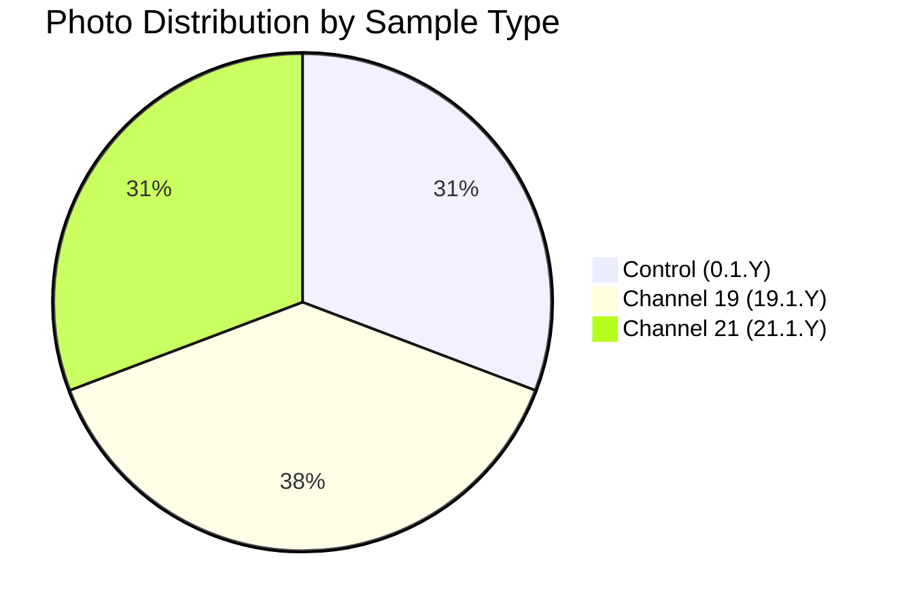

# 📸 Patient 01 Photo Dataset / Фото Dataset Пациента 01

**Experiment Date: 2026-01-24 | Blood Group: II+ | Total Photos: 13**

---

## 🎯 QUICK NAVIGATION / БЫСТРАЯ НАВИГАЦИЯ

| 📊 **Overview** | 📁 **Files** | 📋 **Protocol** | 🔗 **Links** |
|-----------------|--------------|-----------------|--------------|
| [Dataset Info](#dataset-overview) | [Photo List](#photo-inventory) | [Protocol](#experiment-protocol) | [Back to Main](../../../README.md) |
| [Timeline](#experiment-timeline) | [Samples](#samples) | [PDF](../protocol_part-01.pdf) | [All Patients](../../README.md) |

---

## 📊 DATASET OVERVIEW



| Metric | Value |
|--------|-------|
| **📸 Total Photos** | 13 images |
| **🩸 Blood Group** | II+ (Rh positive) |
| **🧪 Samples** | 4 (2 control, 1 ch19, 1 ch21) |
| **⏰ Experiment Duration** | ~1h 12min irradiation |
| **📷 Camera** | iPhone 16 Pro Max |

---

## ⏰ EXPERIMENT TIMELINE

```mermaid
timeline
    title Patient 01 Experiment Timeline
    section Blood Collection
        18:56:10 — 18:59:59 : 🩸 Blood Draw
    section Centrifugation
        19:00:30 — 19:06:10 : 🔄 Centrifuge
    section Irradiation
        19:18:29 — 20:30:00 : ⚡ Hyperbolic Field
    section Photography
        19:00:33 — 20:30:00 : 📸 13 photos
```

---

## 🧪 SAMPLES

| Sample ID | Type | Collection Time |
|-----------|------|-----------------|
| `0.1.1` | ⏸️ Control | 19:12:30 |
| `0.1.2` | ⏸️ Control | 19:14:20 |
| `19.1.1` | ⏩ Channel 19 | 19:13:25 |
| `21.1.1` | ⏪ Channel 21 | 19:13:40 |

---

## 📁 PHOTO INVENTORY

| # | File | Time | Samples | PDF Page |
|---|------|------|---------|----------|
| 1 | `IMG_3250.HEIC` | 19:00:33 | 19.1.1, 21.1.1 | Part 1, p.3 |
| 2 | `IMG_3251.HEIC` | 19:02:24 | 21.1.1 | Part 1, p.4 |
| 3 | `IMG_3252.HEIC` | 19:02:07 | 19.1.1 | Part 1, p.5 |
| 4 | `IMG_3253.HEIC` | 17:32:09 | 19.1.1, 21.1.1, 0.1.1 | Part 1, p.6 |
| 5 | `IMG_3254.HEIC` | 20:46:15 | 0.1.2, 21.1.1, 19.1.1, 0.1.1 | Part 1, p.7 |
| 6 | `IMG_3255.HEIC` | 20:44:22 | 21.1.1, 19.1.1, 0.1.1 | Part 1, p.8 |
| 7 | `IMG_3256.HEIC` | 16:53:57 | 21.1.1, 19.1.1, 0.1.1 | Part 1, p.9 |
| 8 | `IMG_3257.HEIC` | 16:53:09 | 0.1.1, 19.1.1, 21.1.1 | Part 1, p.10 |
| 9 | `IMG_3258.HEIC` | 19:11:17 | 21.1.1, 0.1.1, 19.1.1 | Part 1, p.11 |
| 10 | `IMG_3259.HEIC` | 20:46:28 | 19.1.1, 21.1.1, 0.1.1, 0.1.2 | Part 2, p.1 |
| 11 | `IMG_3260.HEIC` | 20:38:53 | 21.1.1, 0.1.1, 19.1.1 | Part 2, p.2 |
| 12 | `IMG_3261.HEIC` | 17:32:54 | 0.1.1, 21.1.1, 19.1.1 | Part 2, p.3 |
| 13 | `IMG_3262.HEIC` | 19:11:05 | 21.1.1, 0.1.1, 19.1.1 | Part 2, p.4 |

---

## 📄 EXPERIMENT PROTOCOL

| Parameter | Value |
|-----------|-------|
| **Blood Group** | II+ |
| **Blood Collection** | 18:56:10 — 18:59:59 |
| **Centrifugation** | 19:00:30 — 19:06:10 (2000 rpm, 5 min) |
| **Irradiation** | 19:18:29 — 20:30:00 |
| **Temperature** | 17°C constant |

### Protocol PDFs
- [📄 protocol_part-01.pdf](../protocol_part-01.pdf) (~93 MB)
- [📄 protocol_part-02.pdf](../protocol_part-02.pdf) (~38 MB)

---

## 🔗 RELATED DATASETS

| Patient | Photos | Date | Blood Group |
|---------|--------|------|-------------|
| [Patient 02](../../patient-02/photos/) | 25 | 2026-01-28 | III+ |
| [Patient 03](../../patient-03/photos/) | 16 | 2026-01-29 | IV- |
| [Patient 04](../../patient-04/photos/) | 4 | 2026-01-30 | IV+ |
| [Patient 05](../../patient-05/photos/) | 10 | 2026-01-31 | no data |
| [Patient 06](../../patient-06/photos/) | 3 | 2026-02-01 | I+ |
| [Patient 07](../../patient-07/photos/) | 30 | 2026-02-07 | no data |

---

## 📞 CONTACT

| Role | Name | Email |
|------|------|-------|
| Lead Researcher | Ovseannikova Valeria | valeriaovseannicova@asrp.tech |
| Program Director | Banchenko Denis | denisbanchenko@asrp.tech |

---

**Last Updated: 2026-03-26 | Dataset Version: 1.0**
