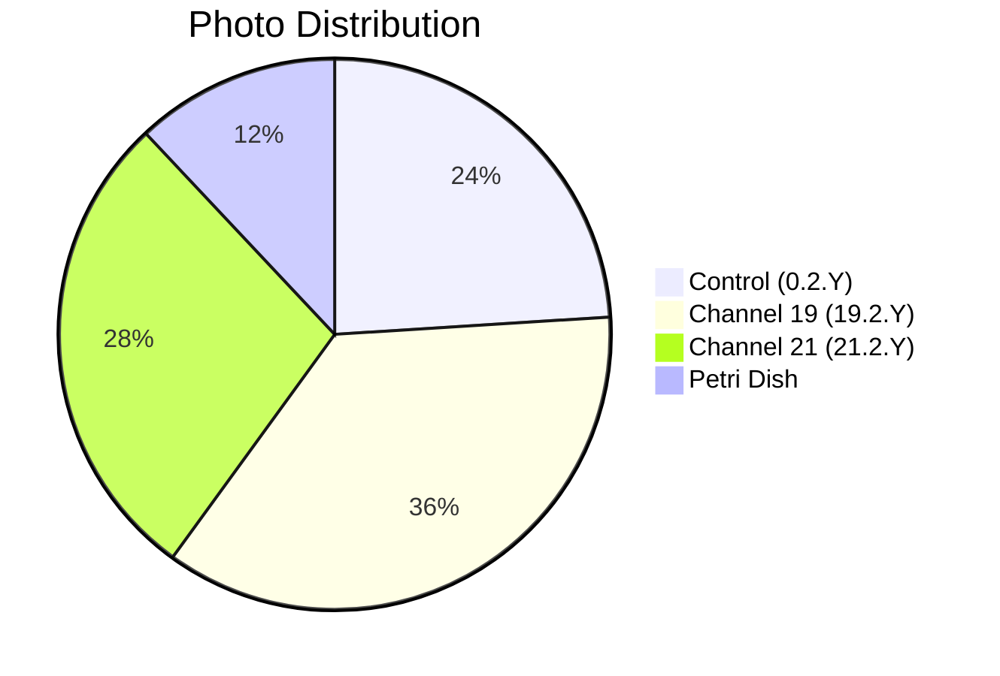

# 📸 Patient 02 Photo Dataset

**Experiment Date: 2026-01-28 | Blood Group: III+ | Total Photos: 25**

---

## 🎯 QUICK NAVIGATION

| [Dataset Info](#dataset-overview) | [Photo List](#photo-inventory) | [Protocol](../protocol_part-01.pdf) | [All Patients](../../README.md) |
|-----------------------------------|--------------------------------|-------------------------------------|--------------------------------|

---

## 📊 DATASET OVERVIEW



| Metric | Value |
|--------|-------|
| **📸 Total Photos** | 25 images |
| **🩸 Blood Group** | III+ |
| **🧪 Samples** | 6 (2 control, 2 ch19, 2 ch21) |
| **⏰ Duration** | ~1h 14min |

---

## ⏰ EXPERIMENT TIMELINE

```mermaid
timeline
    title Patient 02 Timeline
    section Blood Collection
        19:50:50 — 19:54:16 : 🩸 Blood Draw
    section Centrifugation
        19:54:10 — 20:00:10 : 🔄 Centrifuge
    section Irradiation
        20:09:50 — 21:24:10 : ⚡ Hyperbolic Field
    section Photography
        21:29:19 — Next Day : 📸 25 photos
```

---

## 🧪 SAMPLES

| Sample ID | Type | Volume | Time |
|-----------|------|--------|------|
| `0.2.1` | ⏸️ Control | 1.5 ml | 20:06:05 |
| `0.2.2` | ⏸️ Control | 1.0 ml | 20:06:19 |
| `19.2.1` | ⏩ Channel 19 | 1.5 ml | 20:05:35 |
| `19.2.2` | ⏩ Channel 19 | 1.0 ml | 20:05:55 |
| `21.2.1` | ⏪ Channel 21 | 1.5 ml | 20:05:05 |
| `21.2.2` | ⏪ Channel 21 | 1.0 ml | 20:05:25 |

---

## 📁 PHOTO INVENTORY (25 photos)

| # | File | Time | Samples | PDF |
|---|------|------|---------|-----|
| 1 | `IMG_3264.JPG` | 21:29:19 | — | Part 1, p.2 |
| 2 | `IMG_3265.HEIC` | 21:30:20 | 19.2.1 | Part 1, p.3 |
| 3 | `IMG_3266.HEIC` | 21:31:38 | 19.2.1 | Part 1, p.4 |
| 4 | `IMG_3267.HEIC` | 21:32:23 | 19.2.2 | Part 1, p.5 |
| 5 | `IMG_3268.HEIC` | 21:33:17 | 0.2.1 | Part 1, p.6 |
| 6 | `IMG_3269.HEIC` | 21:34:06 | 0.2.2 | Part 1, p.7 |
| 7 | `IMG_3270.HEIC` | 21:34:20 | 21.2.1 | Part 1, p.8 |
| 8 | `IMG_3271.HEIC` | 21:35:43 | 21.2.1 | Part 1, p.9 |
| 9 | `IMG_3272.HEIC` | 21:39:50 | 21.2.2 | Part 1, p.10 |
| 10 | `IMG_3273.HEIC` | 21:40:18 | — | Part 1, p.11 |
| 11 | `IMG_3274.HEIC` | 21:41:52 | 19.2.1, 0.2.1, 21.2.1 | Part 1, p.12 |
| 12 | `IMG_3275.HEIC` | 21:41:58 | — | Part 1, p.13 |
| 13 | `IMG_3276.HEIC` | 21:48:44 | 19.2.2, 0.2.2, 21.2.2 | Part 1, p.14 |
| 14 | `IMG_3277.HEIC` | 21:49:17 | 19.2.2 | Part 2, p.1 |
| 15 | `IMG_3278.HEIC` | 21:50:39 | 0.2.2 | Part 2, p.2 |
| 16 | `IMG_3279.HEIC` | 21:51:21 | 21.2.2 | Part 2, p.3 |
| 17 | `IMG_3280.JPG` | no data | 21.2.1, 19.2.1, 0.2.1 | Part 2, p.4 |
| 18 | `IMG_3281.JPG` | no data | 19.2.1, 0.2.1, 21.2.1 | Part 2, p.5 |
| 19 | `IMG_3282.HEIC` | Next 17:15 | 19.2.1, 0.2.1, 21.2.1 | Part 2, p.6 |
| 20 | `IMG_3283.HEIC` | Next 17:17 | 19.2.1, 0.2.1, 21.2.1 | Part 2, p.7 |
| 21 | `IMG_3284.HEIC` | Next 17:17 | 19.2.1 | Part 3, p.1 |
| 22 | `IMG_3285.HEIC` | Next 17:17 | 21.2.1 | Part 3, p.2 |
| 23 | `IMG_3286.HEIC` | Next 17:28 | 0.2.1 | Part 3, p.3 |
| 24 | `IMG_3287.HEIC` | Next 17:28 | 0.2.1 | Part 3, p.5 |
| 25 | `IMG_3288.HEIC` | Next 17:28 | 19.2.1 | Part 3, p.6 |

---

## 📄 PROTOCOL

| Parameter | Value |
|-----------|-------|
| **Blood Group** | III+ |
| **Blood Collection** | 19:50:50 — 19:54:16 |
| **Centrifugation** | 19:54:10 — 20:00:10 |
| **Irradiation** | 20:09:50 — 21:24:10 |

### PDFs
- [protocol_part-01.pdf](../protocol_part-01.pdf)
- [protocol_part-02.pdf](../protocol_part-02.pdf)
- [protocol_part-03.pdf](../protocol_part-03.pdf)

---

## 🔗 OTHER PATIENTS

| Patient | Photos | Link |
|---------|--------|------|
| Patient 01 | 13 | [View](../../patient-01/photos/) |
| Patient 03 | 16 | [View](../../patient-03/photos/) |
| Patient 04 | 4 | [View](../../patient-04/photos/) |
| Patient 05 | 10 | [View](../../patient-05/photos/) |
| Patient 06 | 3 | [View](../../patient-06/photos/) |
| Patient 07 | 30 | [View](../../patient-07/photos/) |

---

**Last Updated: 2026-03-26**
