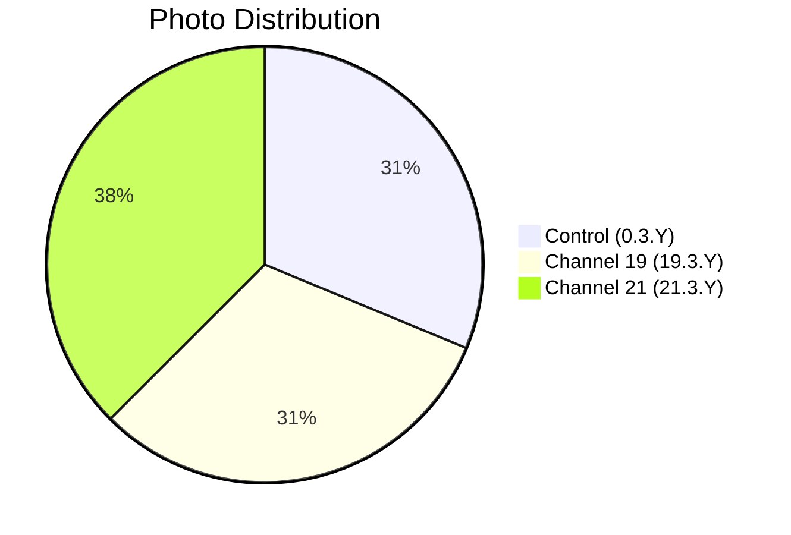

# 📸 Patient 03 Photo Dataset

**Experiment Date: 2026-01-29 | Blood Group: IV- | Total Photos: 16**

---

## 🎯 NAVIGATION

[Dataset Info](#dataset-overview) | [Photo List](#photo-inventory) | [Protocol](../protocol_part-01.pdf) | [All Patients](../../README.md)

---

## 📊 DATASET OVERVIEW



| Metric | Value |
|--------|-------|
| **📸 Total Photos** | 16 images |
| **🩸 Blood Group** | IV- (Rh negative) |
| **🧪 Samples** | 4 (2 control, 1 ch19, 1 ch21) |
| **⏰ Duration** | ~1h 8min |

---

## ⏰ TIMELINE

```mermaid
timeline
    title Patient 03 Timeline
    section Blood Collection
        21:17:30 — 21:21:30 : 🩸 Blood Draw
    section Centrifugation
        21:22:10 — 21:28:00 : 🔄 Centrifuge
    section Irradiation
        21:35:10 — 22:43:32 : ⚡ Hyperbolic Field
    section Photography
        20:41:07 — 21:05:04 : 📸 16 photos
```

**Note:** Plasma samples coagulated rapidly; initial clots visible from moment of pouring.

---

## 🧪 SAMPLES

| Sample ID | Type |
|-----------|------|
| `0.3.1` | ⏸️ Control |
| `0.3.2` | ⏸️ Control |
| `19.3.1` | ⏩ Channel 19 |
| `21.3.1` | ⏪ Channel 21 |

---

## 📁 PHOTO INVENTORY (16 photos)

| # | File | Time | Samples | PDF |
|---|------|------|---------|-----|
| 1 | `IMG_3290.HEIC` | 20:41:07 | 21.3.1 | Part 1, p.3 |
| 2 | `IMG_3291.HEIC` | 20:41:36 | 21.3.1 | Part 1, p.4 |
| 3 | `IMG_3292.HEIC` | 20:42:24 | — | Part 1, p.5 |
| 4 | `IMG_3293.HEIC` | 20:44:44 | 0.3.1 | Part 1, p.6 |
| 5 | `IMG_3294.HEIC` | 20:45:06 | 0.3.1 | Part 1, p.7 |
| 6 | `IMG_3295.HEIC` | 20:49:59 | 0.3.2 | Part 1, p.8 |
| 7 | `IMG_3296.HEIC` | 20:53:49 | 19.3.1 | Part 1, p.9 |
| 8 | `IMG_3297.HEIC` | 20:57:51 | 19.3.1 | Part 1, p.10 |
| 9 | `IMG_3298.HEIC` | 20:58:11 | — | Part 1, p.11 |
| 10 | `IMG_3299.HEIC` | 20:58:23 | 21.3.1 | Part 1, p.12 |
| 11 | `IMG_3300.HEIC` | 20:59:57 | — | Part 1, p.13 |
| 12 | `IMG_3301.HEIC` | 21:04:26 | — | Part 1, p.14 |
| 13 | `IMG_3302.HEIC` | 21:04:46 | 19.3.1 | Part 1, p.15 |
| 14 | `IMG_3303.HEIC` | 20:54:23 | — | Part 1, p.16 |
| 15 | `IMG_3304.HEIC` | 20:58:23 | — | Part 1, p.17 |
| 16 | `IMG_3305.HEIC` | 21:05:04 | 0.3.1, 0.3.2 | Part 1, p.18 |

---

## 📄 PROTOCOL

| Parameter | Value |
|-----------|-------|
| **Blood Group** | IV- |
| **Blood Collection** | 21:17:30 — 21:21:30 |
| **Centrifugation** | 21:22:10 — 21:28:00 |
| **Irradiation** | 21:35:10 — 22:43:32 |

---

## 🔗 OTHER PATIENTS

[P01](../../patient-01/) | [P02](../../patient-02/) | [P04](../../patient-04/) | [P05](../../patient-05/) | [P06](../../patient-06/) | [P07](../../patient-07/)

---

**Last Updated: 2026-03-26**
