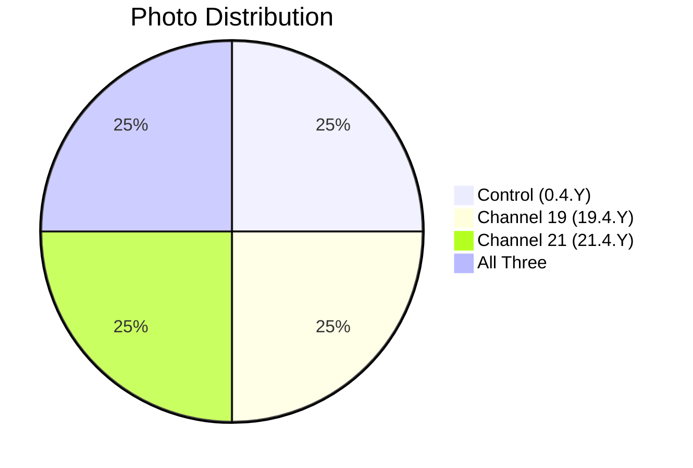

# 📸 Patient 04 Photo Dataset

**Experiment Date: 2026-01-30 | Blood Group: IV+ | Total Photos: 4**

---

## 🎯 NAVIGATION

[Dataset Info](#dataset-overview) | [Photo List](#photo-inventory) | [Protocol](../protocol_part-01.pdf) | [All Patients](../../README.md)

---

## 📊 DATASET OVERVIEW



| Metric | Value |
|--------|-------|
| **📸 Total Photos** | 4 images |
| **🩸 Blood Group** | IV+ |
| **🧪 Samples** | 4 (2 control, 1 ch19, 1 ch21) |
| **⏰ Duration** | ~1h 34min |

---

## ⏰ TIMELINE

```mermaid
timeline
    title Patient 04 Timeline
    section Centrifugation
        16:00:40 — 16:06:02 : 🔄 Centrifuge
    section Irradiation
        16:13:41 — 17:47:32 : ⚡ Hyperbolic Field
    section Photography
        17:36:05 — 17:39:01 : 📸 4 photos
```

---

## 🧪 SAMPLES

| Sample ID | Type |
|-----------|------|
| `0.4.1` | ⏸️ Control |
| `0.4.2` | ⏸️ Control |
| `19.4.1` | ⏩ Channel 19 |
| `21.4.1` | ⏪ Channel 21 |

---

## 📁 PHOTO INVENTORY (4 photos)

| # | File | Time | Samples | PDF |
|---|------|------|---------|-----|
| 1 | `IMG_3307.HEIC` | 17:36:05 | 0.4.1 | Part 1, p.3 |
| 2 | `IMG_3308.HEIC` | 17:36:33 | 19.4.1 | Part 1, p.4 |
| 3 | `IMG_3309.HEIC` | 17:36:57 | 21.4.1 | Part 1, p.5 |
| 4 | `IMG_3310.HEIC` | 17:39:01 | 21.4.1, 0.4.1, 19.4.1 | Part 1, p.6 |

### Plasma Characteristics

| Sample | Color | Clots |
|--------|-------|-------|
| 0.4.1 (Control) | Light yellow, darker center | Present |
| 19.4.1 (Ch19) | Light yellow, olive center | Present |
| 21.4.1 (Ch21) | Light yellow uniform | **No clots** |

---

## 📄 PROTOCOL

| Parameter | Value |
|-----------|-------|
| **Blood Group** | IV+ |
| **Centrifugation** | 16:00:40 — 16:06:02 |
| **Irradiation** | 16:13:41 — 17:47:32 |

---

## 🔗 OTHER PATIENTS

[P01](../../patient-01/) | [P02](../../patient-02/) | [P03](../../patient-03/) | [P05](../../patient-05/) | [P06](../../patient-06/) | [P07](../../patient-07/)

---

**Last Updated: 2026-03-26**
