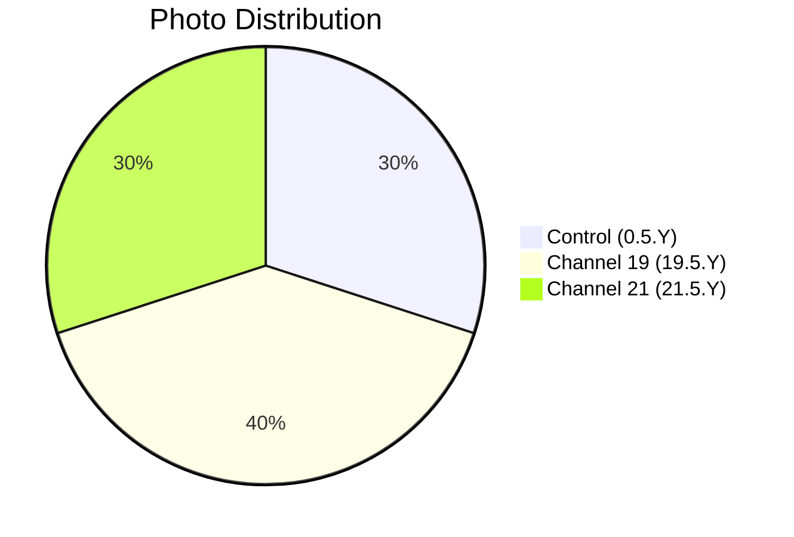

# 📸 Patient 05 Photo Dataset

**Experiment Date: 2026-01-31 | Blood Group: no data | Total Photos: 10**

---

## 🎯 NAVIGATION

[Dataset Info](#dataset-overview) | [Photo List](#photo-inventory) | [Protocol](../protocol_part-01.pdf) | [All Patients](../../README.md)

---

## 📊 DATASET OVERVIEW



| Metric | Value |
|--------|-------|
| **📸 Total Photos** | 10 images |
| **🩸 Blood Group** | no data |
| **🧪 Samples** | 3 (1 control, 1 ch19, 1 ch21) |
| **⏰ Duration** | Night session |

---

## ⏰ TIMELINE

```mermaid
timeline
    title Patient 05 Timeline
    section Night Session
        Late Night : 🌙 Night Experiment
    section Irradiation
        Until 01:21:41 : ⚡ Hyperbolic Field
    section Photography
        01:37:50 — 01:47:10 : 📸 10 photos
```

---

## 🧪 SAMPLES

| Sample ID | Type | Volume |
|-----------|------|--------|
| `0.5.1` | ⏸️ Control | 1.5 ml |
| `19.5.1` | ⏩ Channel 19 | 1.5 ml |
| `21.5.1` | ⏪ Channel 21 | 1.5 ml |

---

## 📁 PHOTO INVENTORY (10 photos)

| # | File | Time | Samples | PDF |
|---|------|------|---------|-----|
| 1 | `IMG_3312.HEIC` | 01:37:50 | — | Part 1, p.3 |
| 2 | `IMG_3313.HEIC` | 01:38:02 | — | Part 1, p.4 |
| 3 | `IMG_3314.HEIC` | 01:41:03 | — | Part 1, p.5 |
| 4 | `IMG_3315.HEIC` | 01:46:59 | 19.5.1 | Part 1, p.6 |
| 5 | `IMG_3316.HEIC` | 01:39:23 | — | Part 1, p.7 |
| 6 | `IMG_3317.HEIC` | 01:40:01 | — | Part 1, p.8 |
| 7 | `IMG_3318.HEIC` | 01:47:05 | 0.5.1 | Part 1, p.9 |
| 8 | `IMG_3319.HEIC` | 01:41:56 | — | Part 1, p.10 |
| 9 | `IMG_3320.HEIC` | 01:42:01 | — | Part 1, p.11 |
| 10 | `IMG_3321.HEIC` | 01:47:10 | 21.5.1 | Part 1, p.12 |

---

## 📄 PROTOCOL

| Parameter | Value |
|-----------|-------|
| **Blood Group** | no data |
| **Irradiation** | Until 01:21:41 |

**Note:** Night session experiment with limited protocol data.

---

## 🔗 OTHER PATIENTS

[P01](../../patient-01/) | [P02](../../patient-02/) | [P03](../../patient-03/) | [P04](../../patient-04/) | [P06](../../patient-06/) | [P07](../../patient-07/)

---

**Last Updated: 2026-03-26**
