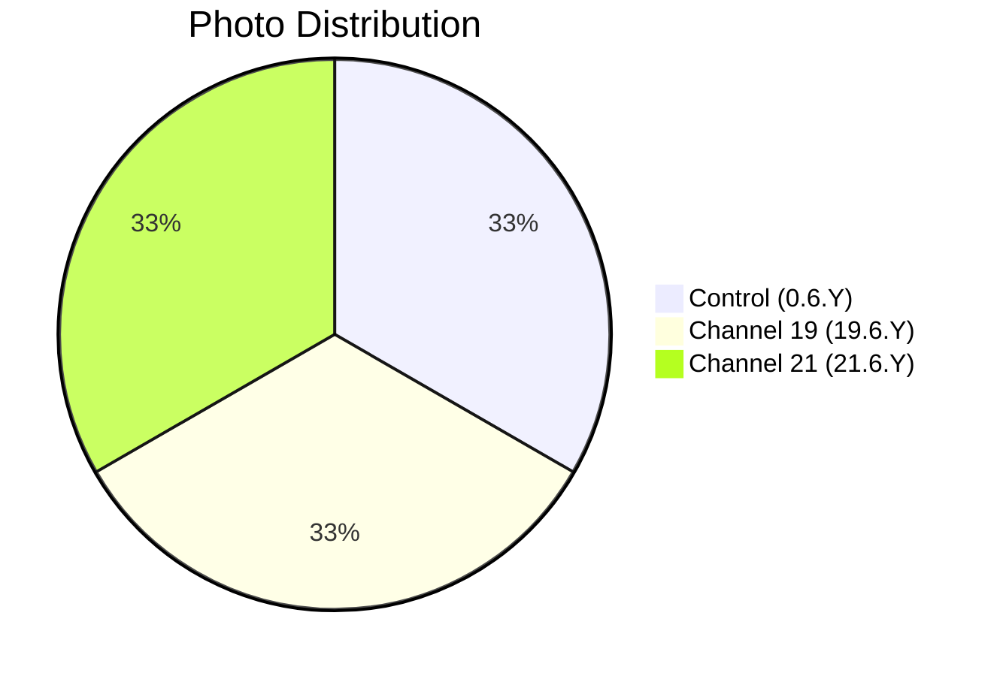

# 📸 Patient 06 Photo Dataset

**Experiment Date: 2026-02-01 | Blood Group: I+ | Total Photos: 3**

---

## 🎯 NAVIGATION

[Dataset Info](#dataset-overview) | [Photo List](#photo-inventory) | [Protocol](../protocol_part-01.pdf) | [All Patients](../../README.md)

---

## 📊 DATASET OVERVIEW



| Metric | Value |
|--------|-------|
| **📸 Total Photos** | 3 images |
| **🩸 Blood Group** | I+ |
| **🧪 Samples** | 6 (2 control, 2 ch19, 2 ch21) |
| **⏰ Duration** | Evening session |

---

## ⏰ TIMELINE

```mermaid
timeline
    title Patient 06 Timeline
    section Evening Session
        Evening : 🌙 Evening Experiment
    section Irradiation
        Until 22:17:03 : ⚡ Hyperbolic Field
    section Photography
        22:25:48 — 22:29:11 : 📸 3 photos
```

---

## 🧪 SAMPLES

| Sample ID | Type | Volume |
|-----------|------|--------|
| `0.6.1` | ⏸️ Control | 1 ml |
| `0.6.2` | ⏸️ Control | 1.5 ml |
| `19.6.1` | ⏩ Channel 19 | 1 ml |
| `19.6.2` | ⏩ Channel 19 | 1.5 ml |
| `21.6.1` | ⏪ Channel 21 | 1 ml |
| `21.6.2` | ⏪ Channel 21 | 1.5 ml |

---

## 📁 PHOTO INVENTORY (3 photos)

| # | File | Time | Samples | PDF |
|---|------|------|---------|-----|
| 1 | `IMG_3323.HEIC` | 22:29:11 | 21.6.2, 19.6.2 | Part 1, p.3 |
| 2 | `IMG_3324.HEIC` | 22:27:42 | All 6 samples | Part 1, p.4 |
| 3 | `IMG_3325.HEIC` | 22:25:48 | 21.6.1, 0.6.1, 19.6.1 | Part 1, p.5 |

**Note:** Smallest dataset but efficiently covers all 6 samples through multi-sample compositions.

---

## 📄 PROTOCOL

| Parameter | Value |
|-----------|-------|
| **Blood Group** | I+ |
| **Irradiation** | Until 22:17:03 |

---

## 🔗 OTHER PATIENTS

[P01](../../patient-01/) | [P02](../../patient-02/) | [P03](../../patient-03/) | [P04](../../patient-04/) | [P05](../../patient-05/) | [P07](../../patient-07/)

---

**Last Updated: 2026-03-26**
