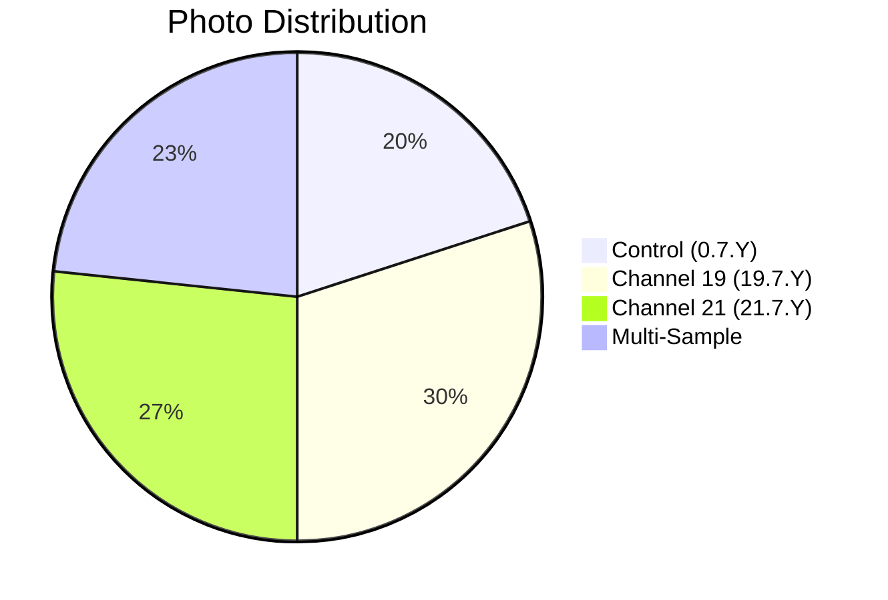

# 📸 Patient 07 Photo Dataset

**Experiment Date: 2026-02-07 | Blood Group: no data | Total Photos: 30**

---

## 🎯 NAVIGATION

[Dataset Info](#dataset-overview) | [Photo List](#photo-inventory) | [Protocol](../protocol_part-01.pdf) | [All Patients](../../README.md)

---

## 📊 DATASET OVERVIEW



| Metric | Value |
|--------|-------|
| **📸 Total Photos** | 30 images |
| **🩸 Blood Group** | no data |
| **🧪 Samples** | 6 (2 control, 2 ch19, 2 ch21) |
| **⏰ Duration** | ~1h 21min |

---

## ⏰ TIMELINE

```mermaid
timeline
    title Patient 07 Timeline
    section Blood Collection
        19:57:47 — 20:03:17 : 🩸 Blood Draw
    section Centrifugation
        20:03:45 — 20:09:15 : 🔄 Centrifuge
    section Irradiation
        20:15:10 — 21:36:07 : ⚡ Hyperbolic Field
    section Photography
        19:58:17 — 20:34:35 : 📸 30 photos
```

---

## 🧪 SAMPLES

| Sample ID | Type | Volume | Time |
|-----------|------|--------|------|
| `0.7.1` | ⏸️ Control | 1 ml | 20:10:41 |
| `0.7.2` | ⏸️ Control | 1.5 ml | 20:09:59 |
| `19.7.1` | ⏩ Channel 19 | 1.5 ml | 20:10:15 |
| `19.7.2` | ⏩ Channel 19 | 1 ml | 20:11:31 |
| `21.7.1` | ⏪ Channel 21 | 1.5 ml | 20:11:07 |
| `21.7.2` | ⏪ Channel 21 | 1 ml | 20:11:56 |

---

## 📁 PHOTO INVENTORY (30 photos)

### Part 1

| # | File | Time | Samples | PDF |
|---|------|------|---------|-----|
| 1 | `IMG_3327.HEIC` | 19:58:17 | — | Part 1, p.3 |
| 2 | `IMG_3328.HEIC` | 19:59:42 | 19.7.1, 21.7.1 | Part 1, p.4 |
| 3 | `IMG_3329.HEIC` | 20:01:42 | — | Part 1, p.5 |
| 4 | `IMG_3330.HEIC` | 20:01:12 | — | Part 1, p.6 |
| 5 | `IMG_3331.HEIC` | 20:00:45 | 19.7.1 | Part 1, p.7 |
| 6 | `IMG_3332.HEIC` | 20:03:46 | — | Part 1, p.8 |
| 7 | `IMG_3333.HEIC` | 20:03:37 | — | Part 1, p.9 |
| 8 | `IMG_3334.HEIC` | 20:02:26 | 19.7.2 | Part 1, p.10 |
| 9 | `IMG_3335.HEIC` | 20:06:30 | — | Part 1, p.11 |
| 10 | `IMG_3336.HEIC` | 20:06:38 | — | Part 1, p.12 |
| 11 | `IMG_3337.HEIC` | 20:06:22 | 21.7.1 | Part 1, p.13 |
| 12 | `IMG_3338.HEIC` | 20:05:29 | — | Part 1, p.14 |
| 13 | `IMG_3339.HEIC` | 20:05:16 | — | Part 1, p.15 |
| 14 | `IMG_3340.HEIC` | 20:05:04 | 21.7.2 | Part 1, p.16 |

### Part 2

| # | File | Time | Samples | PDF |
|---|------|------|---------|-----|
| 15 | `IMG_3341.HEIC` | 20:09:55 | — | Part 2, p.1 |
| 16 | `IMG_3342.HEIC` | 20:09:35 | — | Part 2, p.2 |
| 17 | `IMG_3343.HEIC` | 20:09:41 | — | Part 2, p.3 |
| 18 | `IMG_3344.HEIC` | 20:10:01 | 0.7.1 | Part 2, p.4 |
| 19 | `IMG_3345.HEIC` | 20:09:06 | — | Part 2, p.5 |
| 20 | `IMG_3346.HEIC` | 20:08:06 | — | Part 2, p.6 |
| 21 | `IMG_3347.HEIC` | 20:07:48 | — | Part 2, p.7 |
| 22 | `IMG_3348.HEIC` | 20:08:19 | — | Part 2, p.8 |
| 23 | `IMG_3349.HEIC` | 20:07:58 | 0.7.2 | Part 2, p.9 |
| 24 | `IMG_3350.HEIC` | 20:14:07 | — | Part 2, p.10 |
| 25 | `IMG_3351.HEIC` | 20:11:26 | — | Part 2, p.11 |
| 26 | `IMG_3352.HEIC` | 20:12:07 | All 6 samples | Part 2, p.12 |
| 27 | `IMG_3353.HEIC` | 20:30:48 | — | Part 2, p.13 |
| 28 | `IMG_3354.HEIC` | 20:32:52 | — | Part 2, p.14 |
| 29 | `IMG_3355.HEIC` | 20:34:10 | — | Part 2, p.15 |
| 30 | `IMG_3356.HEIC` | 20:34:35 | 19.7.x, 21.7.x | Part 2, p.16 |

---

## 📄 PROTOCOL

| Parameter | Value |
|-----------|-------|
| **Blood Group** | no data |
| **Blood Collection** | 19:57:47 — 20:03:17 |
| **Centrifugation** | 20:03:45 — 20:09:15 |
| **Irradiation** | 20:15:10 — 21:36:07 |

---

## 🔗 OTHER PATIENTS

[P01](../../patient-01/) | [P02](../../patient-02/) | [P03](../../patient-03/) | [P04](../../patient-04/) | [P05](../../patient-05/) | [P06](../../patient-06/)

---

**Last Updated: 2026-03-26**
