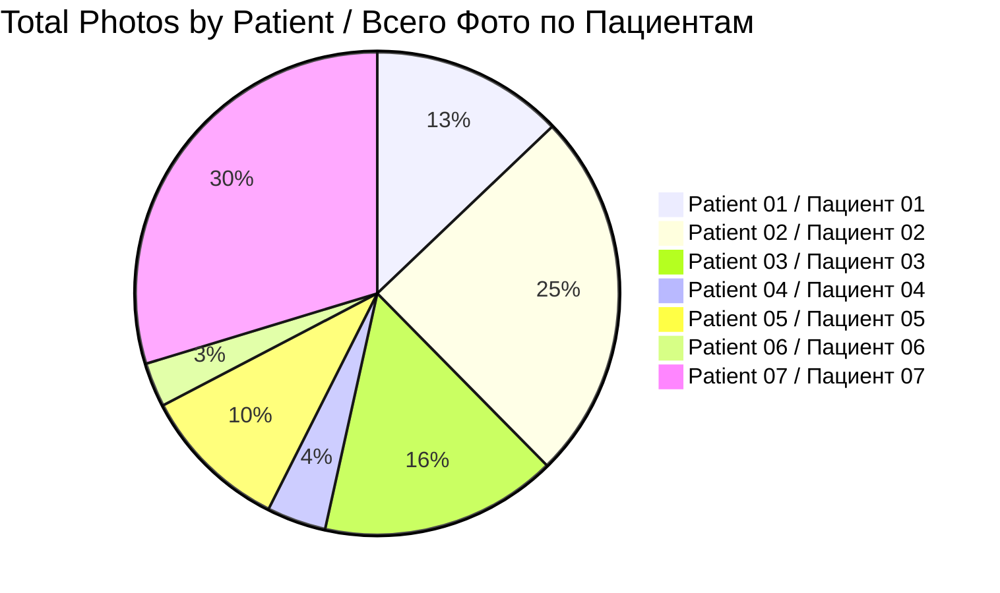
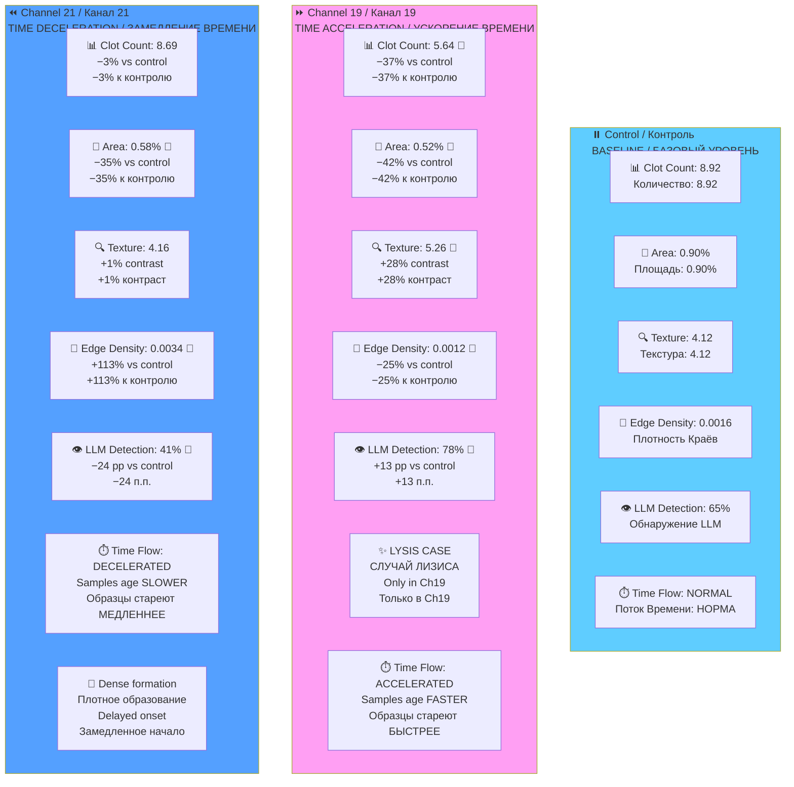
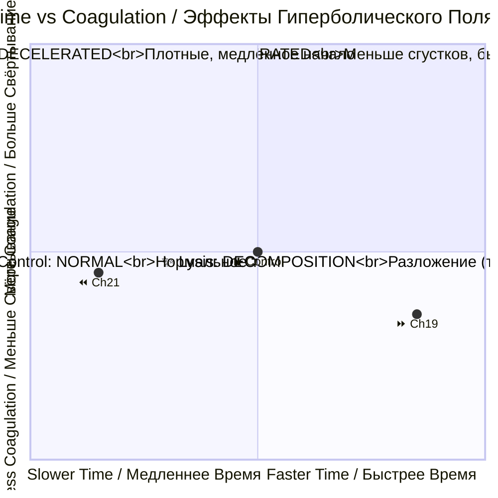
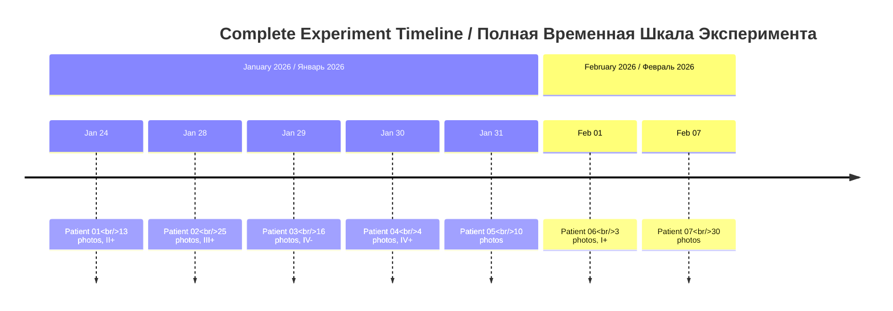

# 📊 Patient Data Hub / Хаб Данных Пациентов

**Hyperbolic Field Blood Plasma Study / Исследование Кровяной Плазмы Гиперболических Полей**

---

## 🎯 QUICK NAVIGATION / БЫСТРАЯ НАВИГАЦИЯ

| 📁 **Patients / Пациенты** | 📊 **Statistics / Статистика** | 📋 **Protocols / Протоколы** |
|----------------------------|--------------------------------|------------------------------|
| [All Patients](#patient-datasets--наборы-данных-пациентов) | [Dataset Stats](#dataset-statistics--статистика-наборов-данных) | [Protocol EN/RU](../reports/experiment_protocol_en.md) |

---

## 📊 DATASET OVERVIEW / ОБЗОР НАБОРОВ ДАННЫХ



| Metric / Метрика | Value / Значение |
|------------------|------------------|
| **👥 Total Patients / Всего Пациентов** | 7 |
| **📸 Total Photographs / Всего Фотографий** | 101 images / 101 изображение |
| **🧪 Total Samples / Всего Образцов** | 33 samples / 33 образца |
| **⏰ Experiment Period / Период Эксперимента** | Jan 24 — Feb 7, 2026 / 24 янв — 7 фев 2026 |
| **🌡️ Temperature / Температура** | 17°C constant / постоянно |

---

## 📈 COMPREHENSIVE CHANNEL METRICS / ВСЕСТОРОННИЕ МЕТРИКИ КАНАЛОВ

### Clot Count & Density / Количество и Плотность Сгустков

```mermaid
barChart
    title Clot Count by Channel (CV Analysis) / Количество Сгустков по Каналам (CV Анализ)
    x-axis "Channel / Канал"
    y-axis "Mean Clot Count / Среднее Количество"
    bar "⏸️ Control\n8.92" : 8.92
    bar "⏩ Channel 19\n5.64 (−37%)" : 5.64
    bar "⏪ Channel 21\n8.69 (−3%)" : 8.69
```

### Clot Area Percentage / Процент Площади Сгустков

```mermaid
barChart
    title Total Clot Area (% of sample) / Общая Площадь Сгустков (% от образца)
    x-axis "Channel / Канал"
    y-axis "Area % / Площадь %"
    bar "⏸️ Control\n0.90%" : 0.90
    bar "⏩ Ch19\n0.52% (−42%)" : 0.52
    bar "⏪ Ch21\n0.58% (−35%)" : 0.58
```

### Texture Analysis (GLCM Contrast) / Текстурный Анализ (Контраст GLCM)

```mermaid
barChart
    title GLCM Texture Contrast / Текстурный Контраст GLCM
    x-axis "Channel / Канал"
    y-axis "Contrast Value / Значение Контраста"
    bar "⏸️ Control\n4.12" : 4.12
    bar "⏩ Ch19\n5.26 (+28%)" : 5.26
    bar "⏪ Ch21\n4.16 (+1%)" : 4.16
```

### Edge Density / Плотность Краёв

```mermaid
barChart
    title Edge Density (Canny) / Плотность Краёв (Кэнни)
    x-axis "Channel / Канал"
    y-axis "Edge Density / Плотность"
    bar "⏸️ Control\n0.0016" : 0.0016
    bar "⏩ Ch19\n0.0012 (−25%)" : 0.0012
    bar "⏪ Ch21\n0.0034 (+113%)" : 0.0034
```

### LLM Clot Detection Rate / Частота Обнаружения Сгустков (LLM)

```mermaid
barChart
    title Clot Detection Rate (LLM Vision) / Частота Обнаружения Сгустков (LLM Зрение)
    x-axis "Channel / Канал"
    y-axis "Detection Rate % / Процент Обнаружения %"
    bar "⏸️ Control\n65%" : 65
    bar "⏩ Ch19\n78%" : 78
    bar "⏪ Ch21\n41%" : 41
```

---

## ⏰ TIME DISTORTION EFFECTS / ЭФФЕКТЫ ИСКАЖЕНИЯ ВРЕМЕНИ

### Complete Effect Summary / Полная Сводка Эффектов



### Abstract Time-Clot Relationship / Абстрактная Связь Время-Сгустки



---

## 📁 PATIENT DATASETS / НАБОРЫ ДАННЫХ ПАЦИЕНТОВ

### Complete Patient Directory / Полный Каталог Пациентов

| # | Patient / Пациент | Photos / Фото | Date / Дата | Blood Group / Группа Крови | Key Feature / Ключевая Особенность | Link / Ссылка |
|---|-------------------|---------------|-------------|---------------------------|-----------------------------------|---------------|
| 1 | **Patient 01 / Пациент 01** | 📸 13 | 2026-01-24 | II+ | First experiment / Первый эксперимент | [📂 View](patient-01/photos/) |
| 2 | **Patient 02 / Пациент 02** | 📸 25 | 2026-01-28 | III+ | Petri dish time-lapse + LYSIS / Чашка Петри + ЛИЗИС | [📂 View](patient-02/photos/) |
| 3 | **Patient 03 / Пациент 03** | 📸 16 | 2026-01-29 | IV- | Rapid coagulation / Быстрое свёртывание | [📂 View](patient-03/photos/) |
| 4 | **Patient 04 / Пациент 04** | 📸 4 | 2026-01-30 | IV+ | No clots in Ch21 / Без сгустков в Ch21 | [📂 View](patient-04/photos/) |
| 5 | **Patient 05 / Пациент 05** | 📸 10 | 2026-01-31 | no data | Night session / Ночная сессия | [📂 View](patient-05/photos/) |
| 6 | **Patient 06 / Пациент 06** | 📸 3 | 2026-02-01 | I+ | Smallest dataset / Самый маленький | [📂 View](patient-06/photos/) |
| 7 | **Patient 07 / Пациент 07** | 📸 30 | 2026-02-07 | no data | Largest dataset / Самый большой | [📂 View](patient-07/photos/) |

---

## ⏰ EXPERIMENT TIMELINE / ВРЕМЕННАЯ ШКАЛА ЭКСПЕРИМЕНТА



---

## 🔬 KEY FINDINGS SUMMARY / СВОДКА КЛЮЧЕВЫХ НАХОДОК

### All Metrics Table / Таблица Всех Метрик

| Metric / Метрика | Control | Ch19 (Acceleration) | Ch21 (Deceleration) |
|------------------|---------|---------------------|---------------------|
| **📊 Clot Count / Количество** | 8.92 | **5.64 (−37%)** 🔻 | 8.69 (−3%) |
| **📏 Clot Area / Площадь** | 0.90% | **0.52% (−42%)** 🔻 | 0.58% (−35%) 🔻 |
| **🔍 Texture Contrast / Контраст** | 4.12 | **5.26 (+28%)** 🔺 | 4.16 (+1%) |
| **📐 Edge Density / Плотность** | 0.0016 | 0.0012 (−25%) 🔻 | **0.0034 (+113%)** 🔺 |
| **👁️ LLM Detection / Обнаружение** | 65% | **78% (+13 pp)** 🔺 | 41% (−24 pp) 🔻 |
| **✨ Lysis Cases / Случаи Лизиса** | 0 | **1 (unique)** 🎯 | 0 |
| **⏱️ Time Perception** | Normal | **Faster / Быстрее** | **Slower / Медленнее** |

### Statistical Significance / Статистическая Значимость

| Analysis / Анализ | Result / Результат | P-value | Significance / Значимость |
|-------------------|-------------------|---------|---------------------------|
| **Gemini LLM Vision** | 57.9% ch19 identification | p = 0.027 | ✅ Significant / Значимо |
| **DINOv2 Linear Probe** | 47.4% ch19 identification | p = 0.146 | 🟡 Suggestive / Предполагаемо |
| **Combined Evidence** | Consistent ch19 signal | — | ✅ Multi-method consensus |

---

## 🔗 NAVIGATION LINKS / ССЫЛКИ НАВИГАЦИИ

| Resource / Ресурс | Link / Ссылка |
|-------------------|---------------|
| **🏠 Main README / Главный README** | [View / Просмотр](../../README.md) |
| **📊 Original Research / Оригинальное Исследование** | [View / Просмотр](../) |
| **📄 Reports / Отчёты** | [View / Просмотр](../reports/) |
| **🔬 Issues / Задачи** | [View / Просмотр](https://github.com/AdvancedScientificResearchProjects/Hyperbolic_Field_BloodPlasma_Study/issues) |

---

## 📞 CONTACT / КОНТАКТЫ

| Role / Роль | Name / Имя | Email |
|-------------|------------|-------|
| **Lead Researcher / Ведущий Исследователь** | Ovseannikova Valeria / Овсянникова Валерия | valeriaovseannicova@asrp.tech |
| **Program Director / Директор Программы** | Banchenko Denis / Банченко Денис | denisbanchenko@asrp.tech |

---

**Last Updated / Последнее Обновление:** 2026-03-26 | **Data Hub Version / Версия Хаба Данных:** 3.0

**© 2026 Advanced Scientific Research Projects (ASRP) / Перспективные Научно-Исследовательские Разработки**
