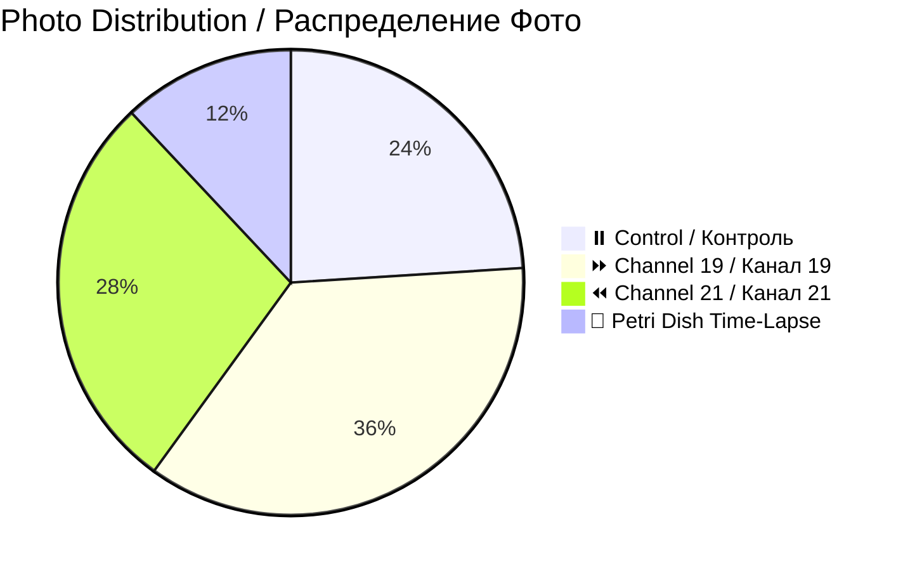
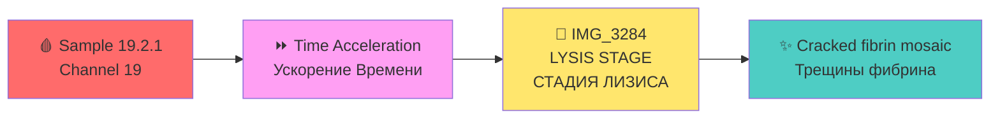

# 📸 Patient 02 Photo Dataset / Фото Dataset Пациента 02

**Experiment Date / Дата Эксперимента:** 2026-01-28 | **Blood Group / Группа Крови:** III+ | **Total Photos / Всего Фото:** 25

---

## 🎯 NAVIGATION / НАВИГАЦИЯ

[Info / Инфо](#dataset-overview) | [Photos / Фото](#photo-inventory) | [Protocol / Протокол](../protocol_part-01.pdf) | [All Patients / Все Пациенты](../../README.md) | [Data Hub / Хаб Данных](../../README.md)

---

## 📊 DATASET OVERVIEW / ОПИСАНИЕ НАБОРА ДАННЫХ



| Metric / Метрика | Value / Значение |
|------------------|------------------|
| **📸 Total Photos / Всего Фото** | 25 images |
| **🩸 Blood Group / Группа Крови** | III+ |
| **🧪 Total Samples / Всего Образцов** | 6 (2 control, 2 ch19, 2 ch21) |
| **⏰ Irradiation Duration / Длительность** | ~1h 14min |

---

## 📈 CHANNEL METRICS / МЕТРИКИ ПО КАНАЛАМ

### Photo Distribution by Type / Распределение по Типам

```mermaid
barChart
    title Patient 02: Photos per Channel / Пациент 02: Фото на Канал
    x-axis "Channel"
    y-axis "Photos"
    bar "⏸️ Control" : 6
    bar "⏩ Ch19" : 9
    bar "⏪ Ch21" : 7
```

### Temporal Coverage / Временное Покрытие

```mermaid
timeline
    title Patient 02: Photo Timeline / Пациент 02: Временная Шкала
    section Immediate
        21:29 : First photo
    section +6 Hours
        Next day : Petri dish
    section +16-21 Hours
        Next day : Macro analysis
```

### Key Finding: LYSIS CASE / Ключевая Находка: ЛИЗИС



**🎯 UNIQUE:** Only lysis case in entire study (101 photos) / Единственный случай лизиса во всём исследовании

---

## 📁 PHOTOS / ФОТО (25)

| # | File / Файл | Time | Samples | Preview |
|---|-------------|------|---------|---------|
| 1 | `IMG_3264` | 21:29:19 | Checklist | [🖼️](jpg/IMG_3264.JPG) |
| 2-9 | `IMG_3265-3272` | 21:30-21:39 | Individual | [🖼️](jpg/) |
| 10-16 | `IMG_3273-3279` | 21:40-21:51 | Comparisons | [🖼️](jpg/) |
| 17-20 | `IMG_3280-3283` | Various | Petri dish | [🖼️](jpg/) |
| 21-25 | `IMG_3284-3288` | Next day | +16-21h | [🖼️](jpg/IMG_3284.jpg) |

---

## 🔗 OTHERS / ДРУГИЕ

[P01](../../patient-01/) | [P03](../../patient-03/) | [P04](../../patient-04/) | [P05](../../patient-05/) | [P06](../../patient-06/) | [P07](../../patient-07/)

---

**Last Updated:** 2026-03-26 | **Version:** 2.0
