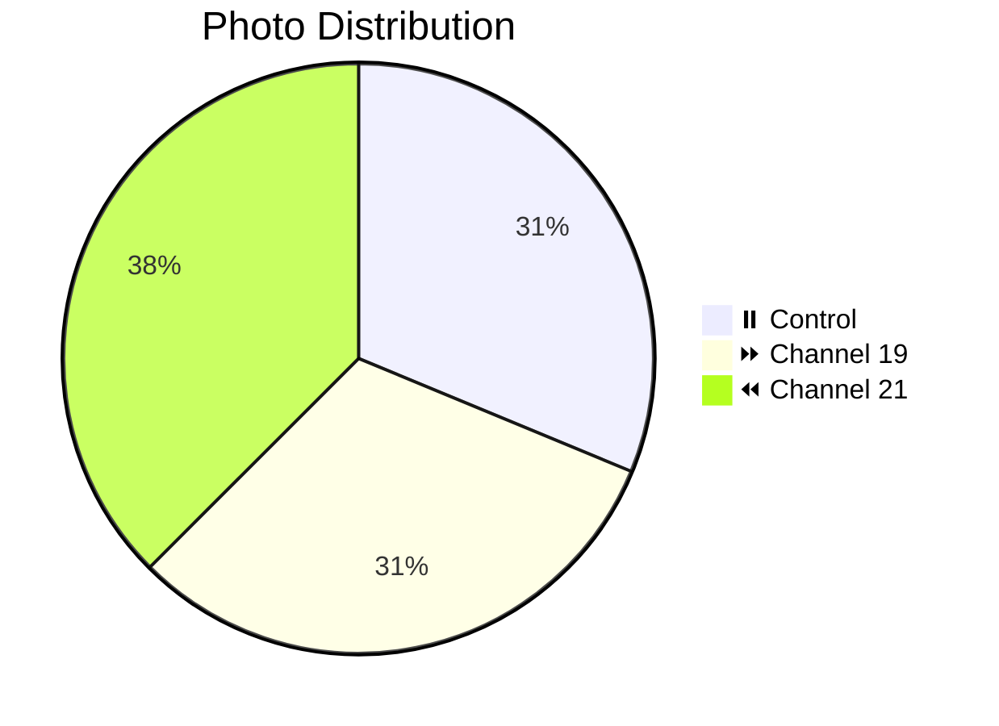

# 📸 Patient 03 Photo Dataset

**Experiment Date:** 2026-01-29 | **Blood Group:** IV- | **Total Photos:** 16

---

## 🎯 NAVIGATION

[Info](#overview) | [Photos](#photo-inventory) | [Protocol](../protocol_part-01.pdf) | [All Patients](../../README.md) | [Data Hub](../../README.md)

---

## 📊 OVERVIEW / ОБЗОР



| Metric | Value |
|--------|-------|
| **📸 Photos** | 16 |
| **🩸 Blood** | IV- (Rh negative) |
| **🧪 Samples** | 4 |

**⚠️ Note:** Rapid coagulation observed / Быстрое свёртывание

---

## 📈 CHANNEL METRICS

### Photo Distribution

```mermaid
barChart
    title Patient 03: Photos per Channel
    x-axis "Channel"
    y-axis "Count"
    bar "⏸️ Control" : 5
    bar "⏩ Ch19" : 5
    bar "⏪ Ch21" : 6
```

### Timeline

```mermaid
timeline
    title Patient 03 Timeline
    section Evening
        21:17 : Blood
        21:22 : Centrifuge
        21:35 : Irradiation
        20:41 : Photos (16)
```

---

## 📁 PHOTOS (16)

| Files | Count | Preview |
|-------|-------|---------|
| `IMG_3290-3305` | 16 | [🖼️](jpg/) |

---

## 🔗 OTHERS

[P01](../../patient-01/) | [P02](../../patient-02/) | [P04](../../patient-04/) | [P05](../../patient-05/) | [P06](../../patient-06/) | [P07](../../patient-07/)

---

**Last Updated:** 2026-03-26
