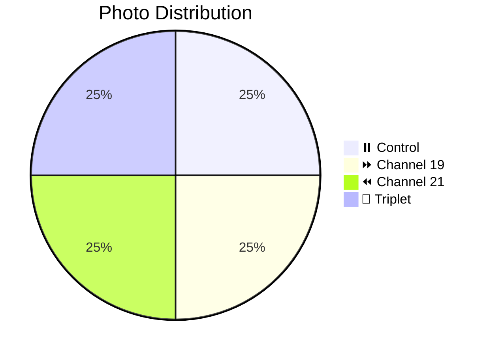
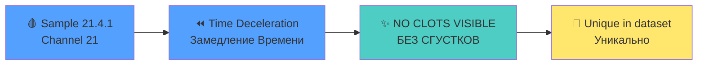

# 📸 Patient 04 Photo Dataset

**Experiment Date:** 2026-01-30 | **Blood Group:** IV+ | **Total Photos:** 4

---

## 🎯 NAVIGATION

[Info](#overview) | [Photos](#photo-inventory) | [Protocol](../protocol_part-01.pdf) | [All Patients](../../README.md) | [Data Hub](../../README.md)

---

## 📊 OVERVIEW / ОБЗОР



| Metric | Value |
|--------|-------|
| **📸 Photos** | 4 (smallest / самый маленький) |
| **🩸 Blood** | IV+ |
| **🧪 Samples** | 4 |

---

## 📈 CHANNEL METRICS

### Key Finding: NO CLOTS in Ch21



### Photo Distribution

```mermaid
barChart
    title Patient 04: Photos per Channel
    x-axis "Channel"
    y-axis "Count"
    bar "⏸️ Control" : 1
    bar "⏩ Ch19" : 1
    bar "⏪ Ch21" : 1
    bar "Triplet" : 1
```

---

## 📁 PHOTOS (4)

| File | Time | Samples | Note | Preview |
|------|------|---------|------|---------|
| `IMG_3307` | 17:36:05 | 0.4.1 | Control | [🖼️](jpg/IMG_3307.jpg) |
| `IMG_3308` | 17:36:33 | 19.4.1 | Ch19 | [🖼️](jpg/IMG_3308.jpg) |
| `IMG_3309` | 17:36:57 | 21.4.1 | **No clots** | [🖼️](jpg/IMG_3309.jpg) |
| `IMG_3310` | 17:39:01 | All | Triplet | [🖼️](jpg/IMG_3310.jpg) |

---

## 🔗 OTHERS

[P01](../../patient-01/) | [P02](../../patient-02/) | [P03](../../patient-03/) | [P05](../../patient-05/) | [P06](../../patient-06/) | [P07](../../patient-07/)

---

**Last Updated:** 2026-03-26
