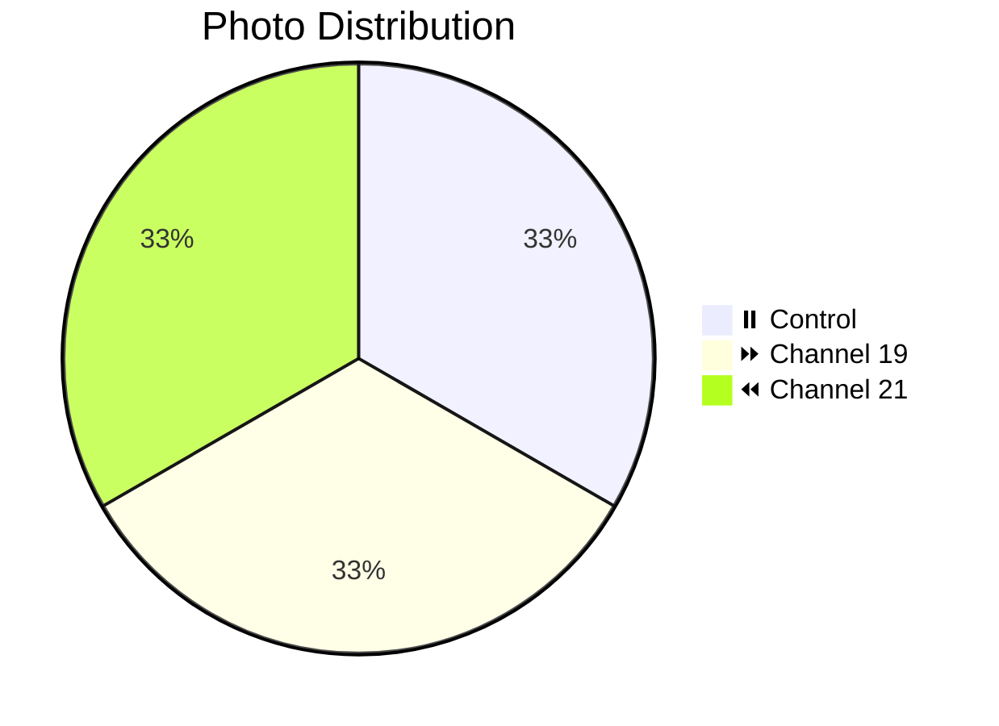
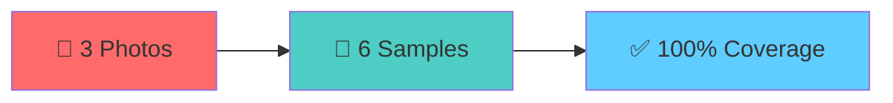

# 📸 Patient 06 Photo Dataset

**Experiment Date:** 2026-02-01 | **Blood Group:** I+ | **Total Photos:** 3

---

## 🎯 NAVIGATION

[Info](#overview) | [Photos](#photo-inventory) | [Protocol](../protocol_part-01.pdf) | [All Patients](../../README.md) | [Data Hub](../../README.md)

---

## 📊 OVERVIEW / ОБЗОР



| Metric | Value |
|--------|-------|
| **📸 Photos** | 3 (smallest / самый маленький) |
| **🩸 Blood** | I+ |
| **🧪 Samples** | 6 (2 control, 2 ch19, 2 ch21) |
| **⏰ Session** | Evening / Вечерняя |

---

## 📈 CHANNEL METRICS

### Efficient Multi-Sample Coverage



### Photo Distribution

```mermaid
barChart
    title Patient 06: Photos per Channel
    x-axis "Channel"
    y-axis "Count"
    bar "⏸️ Control" : 1
    bar "⏩ Ch19" : 1
    bar "⏪ Ch21" : 1
```

---

## 📁 PHOTOS (3)

| File | Time | Samples | Description | Preview |
|------|------|---------|-------------|---------|
| `IMG_3323` | 22:29:11 | 21.6.2, 19.6.2 | 1.5ml samples | [🖼️](jpg/IMG_3323.jpg) |
| `IMG_3324` | 22:27:42 | All 6 | Complete set | [🖼️](jpg/IMG_3324.jpg) |
| `IMG_3325` | 22:25:48 | 21.6.1, 0.6.1, 19.6.1 | 1ml samples | [🖼️](jpg/IMG_3325.jpg) |

---

## 🔗 OTHERS

[P01](../../patient-01/) | [P02](../../patient-02/) | [P03](../../patient-03/) | [P04](../../patient-04/) | [P05](../../patient-05/) | [P07](../../patient-07/)

---

**Last Updated:** 2026-03-26
